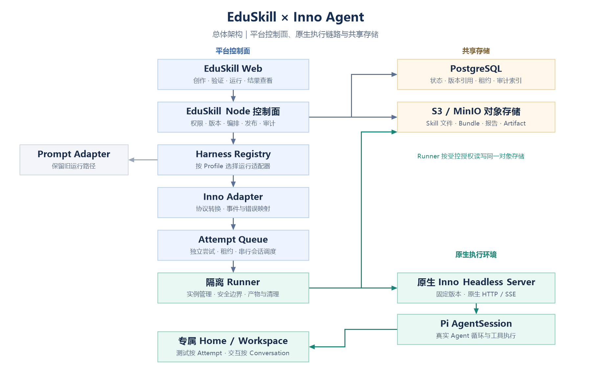

# EduSkill 接入 Inno Agent Harness 工程规范书（飞书审核版）

> - 文档状态：v1.2，工程评审基线；已补齐撤销作用域、会话复用与验证申请入口，按 G0/G1/G2 分阶段审核与准入
> - 文档日期：2026-09-08
> - 架构来源：`docs/plans/2026-09-04-inno-agent-harness-integration-discussion.md` v1.6
> - 兼容基准：`inno-agent 0.5.4`，提交 `fcc669fd4a1164156b4056e52eb6681ec3abf4a9`
> - 本轮性质：把已确认的架构讨论整理成工程规范，不代表已开始实施

**本次仅修订规范，未执行真实 Inno、Sandbox 或数据库测试。最小验证、正式开发和用户交付分别按第 22 节准入，文档修订不等于测试通过或实施授权。**

## 1. 一页结论

| 项目 | 工程结论 |
|---|---|
| 要解决的问题 | 证明一个 Skill 不仅在 EduSkill 的 Prompt 测试中有效，也能被真实 Inno 发现、加载辅助文件、调用工具并完成任务 |
| 第一目标平台 | 固定版本的原生 Inno Agent Headless Server |
| EduSkill 职责 | 多用户控制面：创作、版本、权限、构建、测试、比较、发布和审计 |
| Runner 职责 | 在隔离环境中启动原生 Inno、安装 Skill、执行任务、转发事件、收集 Artifact 并清理 |
| Skill 形态 | 从单个 `skillMd` 扩展为完整目录：`SKILL.md`、`scripts/`、`references/`、`assets/` |
| 版本主线 | `SkillVersion → HarnessBuild → Release`，测试、下载和安装必须使用同一个 `bundleHash` |
| 运行主线 | Run、Test、Arena、Optimization 最终共用 Harness 执行入口；首批只切换 Run 与 Test |
| 安全原则 | 独立实例、默认拒绝、最小授权、Sandbox、配额、审计和确定性清理 |
| 用户范围 | 用户自己的私有 Skill 仓库，不建设公开 Skill 广场 |
| 实施前门禁 | 先完成最小 Runner Spike，未证明真实 Inno、Cancel、Cleanup、隔离和事件映射前不建设正式系统 |

一句话说明：

> EduSkill 负责生产和治理 Skill；固定版本的原生 Inno 负责证明 Skill 在目标平台中的真实行为。

## 2. 当前代码基线

以下结论来自 2026-09-08 对当前仓库的核对，不以讨论稿推测代码。

| 当前代码 | 已确认现状 | 本次处理 |
|---|---|---|
| `educlaw-shared/index.ts` | `PackageSkill` 仍以 `id/dirName/name/description/skillMd` 为主 | 新目录字段全部兼容扩展；旧 Skill 只有 `skillMd` 时仍有效 |
| `educlaw-server/src/routes/actions.ts` | 业务接口使用 `POST /api`、显式 `actionMap` 和认证上下文 | 新 action 继续显式注册，不新增分散 REST 业务入口 |
| `package-service.ts` | 可生成、校验、导入和导出 `SKILL.md`，尚未形成完整多文件版本契约 | 扩展为文件 manifest、Build 和单 Skill Release；不破坏旧导入导出 |
| `agent_skill_versions` | 已有不可变 Skill Version、内容 hash、回退与废弃语义 | 继续作为创作版本真相，不另建平行 Skill Version |
| Package Version | 已有 Package 快照和版本链 | Package 仍是创作、组织和评测容器，不直接作为单 Skill 安装包 |
| `arena-service.ts` | 当前主要把选中 Skill 的 `skillMd` 拼入提示词，Arena 固定 Package/Skill Version | 后续接统一 Harness；历史 Thread 和运行结果不重写 |
| 对象存储 | 已有 S3/MinIO 兼容服务和短期签名能力 | 复用服务，扩展 Skill 文件、Bundle 和 Artifact 对象路径 |
| PostgreSQL 任务模式 | 已有租约、心跳、重试和幂等的媒体任务实现 | 只借鉴可靠性模式；Harness Attempt 生命周期单独建模，不混入媒体任务表 |
| Harness 相关代码 | 当前没有 `HarnessBuild`、`Release`、Inno Adapter 或 Runner 正式实现 | 必须从 Spike 开始，不声称已有能力 |

兼容原则：不重构、不替换现有 Package、Skill Version、Package Version、Arena、登录权限和旧 Prompt Runtime；新功能通过版本级开关渐进接入。

## 3. 用户能看到什么

### 3.1 核心概念

| 用户名称 | 工程对象 | 用户理解 |
|---|---|---|
| Skill | `Skill` | 一项可被 Agent 发现和使用的能力 |
| Skill 版本 | `SkillVersion` | 用户保存的一版 Skill 内容和完整文件清单 |
| Inno 构建 | `HarnessBuild` | 平台针对固定 Inno 环境生成并测试的安装内容；普通用户无需看到内部名称 |
| 可安装版本 | `Release` | 已完成规定验证、可下载到个人仓库的不可变版本，不代表公开上架 |
| 运行 | `Run` | 用户发起的一轮执行请求 |
| 实际执行 | `Attempt` | Run 的一次真实执行或重试；失败证据不会被下一次覆盖 |
| 输出文件 | `Artifact` | Agent 在本轮任务中明确产生并交付的文件 |
| 验证报告 | `ValidationReport` | 说明在哪个 Inno、模型、权限和环境下验证过 |

### 3.2 用户主流程

```text
编辑 Skill 目录
→ 保存新的 SkillVersion
→ 选择“验证 Inno 兼容性”
→ 构建同一份 HarnessBuild
→ 静态与能力检查
→ 真实 Inno 行为测试
→ 全新 Inno 安装测试
→ 查看验证报告
→ 确认生成个人仓库 Release
→ 下载同一 bundleHash 的 ZIP
```

运行流程：

```text
选择 Skill/Release
→ 创建 Run 并立即返回排队状态
→ Runner 在独立环境中启动原生 Inno
→ 前端接收 SSE 进度、文本、工具和 Artifact 事件
→ 完成、失败、取消或超时
→ 查看结果和报告
```

### 3.3 页面恢复与异常呈现

| 场景 | 用户看到的结果 | 服务端要求 |
|---|---|---|
| 刷新、重登或关闭浏览器 | 回到真实阶段和已有事件 | 状态、事件和 Artifact 元数据来自服务端，不依赖前端临时状态 |
| Skill 未被发现 | 明确显示“Skill 未被 Inno 发现” | 保存 Profile、Bundle、原生错误和诊断入口 |
| 工具或权限缺失 | 显示缺少的能力与处理建议 | 不用模糊模型文案代替稳定错误码 |
| 依赖未准备 | 显示“需要准备环境”及检查失败项 | 不错误标记为“安装即可使用” |
| 运行失败 | 显示失败阶段、已产生 Artifact 和是否可重试 | 重试创建新 Attempt，不覆盖失败记录 |
| 取消 | 显示正在终止、收集或清理；无法确认停止时显示失败及隔离状态 | SSE 断开或收到取消响应不能直接算取消成功；会话可保留健康主进程，但本轮工具及子进程必须停止 |
| Worker/Runner 丢失 | 显示中断、回收进度或最终失败状态 | 先隔离旧执行，再按副作用与重试策略决定是否新建 Attempt，不自动接管旧可写目录 |
| 条件兼容 | 清楚列出未覆盖条件 | 不显示“Inno 已验证” |

## 4. 首批范围

### 4.1 包含

首批交付覆盖 Phase 0 至 Phase 3：

| 范围 | 交付内容 |
|---|---|
| 固定基准 | 一套固定 Inno Profile、能力矩阵、错误映射和黄金样本 |
| Runner Spike | 真实 Inno 启动、Skill 安装、工具调用、SSE、Artifact、Cancel、Cleanup、隔离和权限 |
| 多文件 Skill | `SKILL.md`、`scripts/`、`references/`、`assets/` 的编辑、版本化和安全导出 |
| 个人仓库 | 草稿、历史版本、验证状态、Release 和 ZIP 下载 |
| 真实 Run/Test | 使用原生 Inno 执行并展示工具轨迹、事件和输出文件 |
| 安装验证 | 同一 `bundleHash` 在全新 Inno 实例中安装并复现关键行为 |
| 旧运行时兼容 | 原有 Skill 保持 Prompt Runtime；按 SkillVersion 渐进切换与回退 |

### 4.2 不包含

| M1/首批不做 | 说明 |
|---|---|
| 公开 Skill 广场 | 不做公开目录、评分、收藏、推荐和运营 |
| 第二套生产 Harness | 只保留 Adapter 边界；Fake Adapter 只能做契约测试 |
| 重写 Inno/Pi Agent 循环 | 必须调用固定版本的原生 Inno |
| 迁移 Inno 桌面界面 | 只接 Headless Server 的运行能力 |
| 通用一键依赖安装系统 | 首版提供环境检查与准备说明，用户主动执行或授权 |
| 任意脚本和任意联网 | 未声明、未审核和未授权的能力默认拒绝 |
| Arena 与 Optimization 全量切换 | 放 Phase 4；首批只保留接口和数据边界 |
| Inno Content Hub | 当前仅个人私有仓库；未来私有直连另行评审 |
| 一次性下线旧 Prompt Runtime | 先 Shadow、再按版本切换，保留回退 |

## 5. 总体架构与职责



| 组件 | 负责 | 不负责 |
|---|---|---|
| EduSkill Web | Skill 文件、验证、运行、事件、Artifact 和报告界面 | 不直接连接 Runner，不保存业务真相 |
| Node 控制面 | 登录、对象归属、版本、Build、Release、Run 编排、幂等、权限和审计 | 不在 API 进程执行用户脚本或维护 Pi Session |
| Harness Registry | 按 Profile 选择 Adapter，暴露公共能力和事件 | 不包含产品业务分支 |
| Inno Adapter | 把公共请求转换为 Inno HTTP/SSE，并映射事件和错误 | 不复制 Agent 循环，不保存用户业务状态 |
| Runner | 隔离环境、原生进程、Sandbox、配额、Artifact 和清理 | 不管理用户、仓库版本、Arena 评分或发布资格 |
| PostgreSQL | 关系、状态、租约、版本引用、事件序号、报告和审计索引 | 不保存 Bundle、脚本和 Artifact 大文件 |
| 对象存储 | Skill 文件、Bundle、原生事件附件和 Artifact 字节 | 不是权限判断或状态机 |

### 5.1 公共 Harness Port

核心层只理解以下稳定动作：

```text
prepare(target, fixture, profile, effectivePolicy, mode=create|reuse) → runtimeHandle
run(runtimeHandle, executionRequest) → executionHandle
stream(executionHandle, cursor)
cancel(executionHandle)
collectArtifacts(executionHandle)
dispose(runtimeHandle)
```

Inno/Pi 私有类型、工具名和事件结构只能进入 Inno Builder、Adapter 与 Runner。核心业务代码不得导入 Inno/Pi 私有类型。

两个 handle 均为不透明标识：runtimeHandle 绑定实例与执行代次，executionHandle 绑定本轮 Attempt；原生 sessionId、turnId 和 clientRequestId 由 Runner 持久映射。prepare 的 reuse 必须验证原实例所有权和健康，不能隐式新建。target 使用带类型的联合：Inno 指定 Build，旧 Prompt 指定不可变旧版本快照；旧记录不补造 Build，也不改写历史。

## 6. Skill 目录与版本规范

### 6.1 单 Skill 目录

```text
skill-name/
├── SKILL.md
├── scripts/
├── references/
└── assets/
```

| 规则 | 要求 |
|---|---|
| 单 Skill | Release 根目录恰好一个 `SKILL.md`，不得把多 Skill Package ZIP 送入单 Skill 安装入口 |
| Frontmatter | `name` 与 `description` 必须满足 Agent Skills 和目标 Inno 约束；description 同时说明做什么、何时使用 |
| 路径 | 全部使用 Skill 根目录相对路径；禁止绝对路径、`..`、symlink、大小写冲突和路径穿越 |
| 内容 | 不包含 `.git`、`node_modules`、缓存、临时文件、密钥或开发机状态 |
| 规范化 | 文件排序、文本换行、归档时间和权限位规范化，相同内容必须得到相同 hash |
| 旧 Skill | 只有 `skillMd` 时等价为只有根目录 `SKILL.md`，无需用户手工迁移 |

以上目录是组织约定，不是 Agent Skills 只允许四类路径的限制。标准依赖清单、锁文件和准备说明可以随包携带；SKILL.md 应通过相对路径说明环境检查、准备步骤、调用方式和产物位置，不依赖平台内部 manifest 才能使用。脚本通过声明的解释器调用，不依赖开发机绝对路径或可执行位。

规范化算法必须带版本：冻结根目录布局、文本类型及换行规则、二进制原样保留规则、排序和权限策略。bundleHash 表示规范化内容树，archiveHash 表示交付 ZIP 实际字节；ZIP 构建后冻结，下载不临时重新打包。安全检查覆盖重复条目、文件/目录重名、大小写和规范化冲突、反斜杠路径、链接及特殊文件，并在使用前冻结解压大小、条目数与压缩比上限。

### 6.2 Package 输入边界

Package 继续组织创作与评测，但单 Skill Release 只包含 Skill 自身文件：

| 输入 | 内容 | 是否进入 Release |
|---|---|---:|
| Skill 内容 | `SKILL.md`、`scripts/`、`references/`、`assets/` | 是 |
| Workspace fixture | `agent.md`、初始工作区文件和测试数据 | 否，只在运行时物化 |
| Runtime config | Profile、模型、工具权限、网络和资源限制 | 否，只进入运行快照与 provenance |
| Evaluator config | `rubric.md`、断言和评分方式 | 否，只供 EduSkill 评价 |

影响 Agent 行为的专项规则必须进入 Skill；工作区长期背景放 `agent.md`；只用于评分的规则留在 `rubric.md`。不得靠运行时注入 rubric 掩盖 Skill 自身缺少的行为要求。

### 6.3 Script 声明

每个可执行脚本必须在 Build manifest 声明：

| 类别 | 必填内容 |
|---|---|
| 入口 | 相对路径、运行时、版本约束、入口和调用方式 |
| 依赖 | 依赖清单、锁文件或可复现来源 |
| 输入 | 工作目录、参数和输入文件 |
| 能力 | 网络、凭据和 Harness capability 要求 |
| 配额 | 时间、内存、磁盘和输出大小 |
| 产物 | Artifact 路径或显式收集规则 |

未声明、无法锁定或无法在干净环境复现的运行时、依赖和网络需求属于硬错误。

脚本 manifest 只声明随包入口和运行前提，不授予权限。Profile 若开放通用 shell/解释器，必须明确允许的动态代码范围，并由第 11 节执行边界约束；不得同时宣称“只有登记脚本可能执行”。allowed-tools 不作为独立安全门禁。

### 6.4 三层不可变模型

| 层 | 内容 | 不可变规则 |
|---|---|---|
| SkillVersion | 用户确认的一版 Skill 文件 manifest | 一经创建内容即不可变；草稿可编辑，保存创建新版本 |
| HarnessBuild | 固定 SkillVersion、Builder、Profile 和实际文件 hash | 完成后不得替换 manifest 或 Bundle |
| Release | 指向 HarnessBuild 和确定的验证记录集合，并分配仓库版本号 | 内容与验证事实冻结；弃用、安全撤销资格单独管理 |

构建键：

```text
skillVersionId + harnessProfileId + builderVersion + normalizedInputHash
```

同一构建键复用不可变构建内容，不自动复用验证资格。normalizedInputHash 覆盖完整文件 manifest、脚本声明、规范化算法版本及全部构建选项；Profile 引用不可变修订。验证复用另按完整验证条件匹配，定义见第 12 节；同一个幂等键配不同请求摘要返回 `409 IDEMPOTENCY_CONFLICT`。

## 7. 数据设计

### 7.1 数据原则

| 原则 | 规范 |
|---|---|
| 复用版本链 | 不另建 Skill/Package 平行版本系统 |
| 少存大文件 | PostgreSQL 存对象键、hash、状态和必要 manifest；字节进入对象存储 |
| 不可变 | Build、Release 和历史 Attempt 不覆盖 |
| 幂等 | 构建、发布、运行创建和 Runner 回写都保存请求/结果摘要 |
| 事务 | Release 冻结、版本号、Build 引用和报告摘要同事务完成 |
| JSONB | 用于 manifest、配置快照、环境指纹和报告；用户归属、状态、版本 ID、租约和事件序号使用正式列 |
| 约束边界 | Harness 的 FK/CHECK 策略由迁移评审逐项确定，不把近期其他模块的限制自动推广为全局原则；基础引用和行内不变量评估数据库约束，权限和跨对象状态机由服务层负责，不引入存储过程或触发器 |
| 历史约束 | 不破坏性删除现有 FK/CHECK；旧数据和旧 action 保持兼容 |

若经评审决定不用 FK/CHECK，必须明确引用校验、统一锁顺序、条件更新、引用创建与删除的串行化规则，以及孤儿审计和修复责任；事务内“先查再写”本身不作为并发安全证明。

### 7.2 现有对象扩展

`PackageSkill`/Skill Version 快照新增字段全部可选：

```json
{
  "skillMd": "...",
  "files": [
    {
      "path": "references/guide.md",
      "kind": "reference",
      "objectKey": "skill-versions/456/source/references/guide.md",
      "sha256": "...",
      "sizeBytes": 1024,
      "mediaType": "text/markdown"
    }
  ],
  "scriptManifest": [],
  "sourceManifestHash": "..."
}
```

以上 files 是旧接口的辅助文件投影，不包含根 SKILL.md；内部规范 manifest 则包含根 SKILL.md，skillMd 从该根文件派生，禁止双重真相。新建旧格式 Skill 时可规范化为单文件；更新省略 files 表示保留辅助文件，只更新提交的 Markdown。文件删除和完整替换必须显式操作并携带 expectedRevisionNo，不能把字段缺失当删除。接受完整 manifest 的入口若同时收到 skillMd，内容冲突必须拒绝。版本保存、回退、导入与 Package 快照路径均须保留完整文件集合；旧客户端没有修订号时，拒绝其编辑已有多文件对象并提示升级，不能无条件覆盖。

### 7.3 新增核心表

为便于审核，字段只列必须进入正式列的部分；manifest 细节使用有界 JSONB Schema。

#### `harness_profiles`

| 字段 | 类型 | 必填/默认 | 含义 | UNIQUE/索引 |
|---|---|---|---|---|
| `id` | bigserial | 必填 | Profile ID | 主键 |
| `profile_key` | text | 必填 | 稳定键，如 `inno-0.5.4-fcc669f` | UNIQUE |
| `harness_type` | text | 必填 | 首批为 `inno` | 索引 |
| `version_manifest_json` | jsonb | 必填 | Inno、Pi、锁文件、Builder、Adapter 和镜像摘要 | 运行时 Schema |
| `capability_snapshot_json` | jsonb | 必填 | 工具、事件、取消和 Artifact 能力快照 | 运行时 Schema |
| `status` | text | 默认 `active` | `active/retired` | 服务层状态机 |
| `created_at` | timestamptz | 默认 now | 创建时间 | — |

#### `harness_builds`

| 字段 | 类型 | 必填/默认 | 含义 | UNIQUE/索引 |
|---|---|---|---|---|
| `id` | bigserial | 必填 | Build ID | 主键 |
| `user_id` | text | 必填 | 所有者 | `(user_id, created_at desc)` |
| `skill_version_id` | bigint | 必填 | 固定 Skill Version | 索引；服务层校验归属 |
| `harness_profile_id` | bigint | 必填 | 固定 Profile | 索引 |
| `builder_version` | text | 必填 | Builder 版本 | — |
| `input_hash` | text | 必填 | 规范化构建输入摘要 | 与前三项组成 UNIQUE |
| `bundle_hash` | text | 完成后必填 | 解包后规范化内容 hash | 索引 |
| `archive_hash` | text | 完成后必填 | 冻结 ZIP 实际字节的 SHA-256 | — |
| `status` | text | 默认 `queued` | `queued/building/ready/failed`；ready 仅表示内容构建就绪 | `(status, created_at)` |
| `manifest_json` | jsonb | 必填 | 文件、脚本、能力、环境和对象引用 | 运行时 Schema |
| `error_json` | jsonb | 可空 | 稳定错误 | — |
| `created_at` | timestamptz | 默认 now | 创建时间 | `(user_id, created_at desc)` |
| `finished_at` | timestamptz | 可空 | 完成或失败时间 | — |

#### `skill_releases`

| 字段 | 类型 | 必填/默认 | 含义 | UNIQUE/索引 |
|---|---|---|---|---|
| `id` | bigserial | 必填 | Release ID | 主键 |
| `user_id` | text | 必填 | 所有者 | `(user_id, updated_at desc)` |
| `skill_id` | bigint | 必填 | 对应 Skill | 索引 |
| `skill_version_id` | bigint | 必填 | 对应版本 | 索引 |
| `harness_build_id` | bigint | 必填 | 固定 Build | 索引；服务层校验内容就绪及验证资格 |
| `release_number` | integer | 必填 | 个人仓库版本号 | UNIQUE `(skill_id, release_number)` |
| `status` | text | 默认 `active` | `active/deprecated/revoked`；撤销后禁止新下载与新执行 | 索引 |
| `verification_scope_json` | jsonb | 必填 | 已通过的 Profile、模型、权限、fixture、环境和报告引用 | 运行时 Schema |
| `created_at` | timestamptz | 默认 now | 创建时间 | — |
| `updated_at` | timestamptz | 默认 now | 更新时间 | `(user_id, updated_at desc)` |

Release 创建必须检查确定的验证记录集合及适用范围，不只检查 Build.ready。验证记录状态为 passed/conditional/failed；未执行显示 unverified，conditional/failed 不获得发布资格。同一 Build 可有不同验证范围的 Release，版本号与幂等键防止重复发布，不以 Build 唯一约束阻止合法复验发布。

Profile 的版本 manifest、能力快照和策略修订一经引用即不可变；修改内容创建新 Profile 修订，active/retired 单独管理。

安全资格与不可变内容、历史验证事实分离保存。撤销记录必须包含 scope、目标 ID、原因、操作者、时间与活跃执行处置策略：Release 级撤销仅取消该发布记录的资格，不自动永久封禁相同内容；内容安全封禁则明确指向 Build 或 SkillVersion（覆盖其派生 Build）。直接 Build 运行、Release 运行/下载、Conversation 新轮次、验证申请及新建 Release 均检查同一内容安全资格，不能通过换入口或重发版本绕过。服务端创建请求与实际分派前都要校验，关联活跃执行按作用域受控取消。审批解除安全封禁须另留审计，不能修改原内容或抹去撤销历史。

#### `harness_conversations`

| 字段 | 类型 | 必填/默认 | 含义 | UNIQUE/索引 |
|---|---|---|---|---|
| `id` | bigserial | 必填 | 多轮会话 ID | 主键 |
| `user_id` | text | 必填 | 所有者 | `(user_id, updated_at desc)` |
| `package_id` | bigint | 必填 | 所属 Package | 索引；服务层校验归属 |
| `harness_build_id` | bigint | 必填 | 本会话固定 Build | 索引 |
| `harness_profile_id` | bigint | 必填 | 固定 Profile | 索引 |
| `status` | text | 默认 `active` | `active/interrupted/closed` | 索引 |
| `runtime_lease_owner` | text | 可空 | 当前专属 Runner | 仅运行期使用 |
| `runtime_lease_token_hash` | text | 可空 | 租约摘要 | 禁止写日志 |
| `runtime_lease_expires_at` | timestamptz | 可空 | 租约到期 | 回收索引 |
| `environment_fingerprint` | text | 必填 | Profile、模型、工具、fixture 和策略摘要 | 索引 |
| `created_at` | timestamptz | 默认 now | 创建时间 | — |
| `updated_at` | timestamptz | 默认 now | 更新时间 | `(user_id, updated_at desc)` |

#### `harness_runs`

| 字段 | 类型 | 必填/默认 | 含义 | UNIQUE/索引 |
|---|---|---|---|---|
| `id` | bigserial | 必填 | 用户可见 Run ID | 主键 |
| `user_id` | text | 必填 | 所有者 | `(user_id, created_at desc)` |
| `package_id` | bigint | 必填 | 所属 Package | 索引；服务层校验归属 |
| `conversation_id` | bigint | 交互时必填 | 多轮边界；Test/Arena 可空 | 索引 |
| `surface` | text | 必填 | `run/test/arena/optimize/release_validation` | 索引 |
| `harness_build_id` | bigint | 必填 | 实际执行 Build | 索引 |
| `input_snapshot_json` | jsonb | 必填 | 消息、fixture、模型、权限和限制的不可变快照 | 运行时 Schema |
| `request_hash` | text | 必填 | 规范化请求摘要 | 幂等校验 |
| `status` | text | 默认 `queued` | `queued/running/completed/failed/cancelled/timed_out` | `(status, created_at)` |
| `current_attempt_no` | integer | 默认 0 | 最新 Attempt 序号 | — |
| `created_at` | timestamptz | 默认 now | 创建时间 | `(user_id, created_at desc)` |
| `finished_at` | timestamptz | 可空 | 终态时间 | — |

#### `harness_attempts`

| 字段 | 类型 | 必填/默认 | 含义 | UNIQUE/索引 |
|---|---|---|---|---|
| `id` | bigserial | 必填 | Attempt ID | 主键 |
| `run_id` | bigint | 必填 | 所属 Run | UNIQUE `(run_id, attempt_no)` |
| `attempt_no` | integer | 必填 | 重试序号，从 1 开始 | — |
| `status` | text | 默认 `queued` | `queued/leased/preparing/running/collecting/succeeded/failed/cancelled/timed_out` | 领取索引 |
| `available_at` | timestamptz | 默认 now | 退避后可领取时间 | `(status, available_at)` |
| `lease_owner` | text | 可空 | Runner 实例标识 | leased/preparing/running/collecting 及受限停止期均须有有效管理者 |
| `lease_token_hash` | text | 可空 | 租约令牌摘要 | 禁止写日志 |
| `lease_expires_at` | timestamptz | 可空 | 租约到期时间 | 到期索引 |
| `heartbeat_at` | timestamptz | 可空 | 最近心跳 | — |
| `progress_json` | jsonb | 默认 `{}` | 粗粒度进度 | 运行时 Schema |
| `result_json` | jsonb | 可空 | 成功结果摘要 | 运行时 Schema |
| `error_json` | jsonb | 可空 | 稳定错误码、范围和重试建议 | 运行时 Schema |
| `result_hash` | text | 可空 | 幂等完成摘要 | 重复回写比较 |
| `cancel_requested_at` | timestamptz | 可空 | 取消请求 | Runner 心跳检查 |
| `created_at` | timestamptz | 默认 now | 创建时间 | — |
| `finished_at` | timestamptz | 可空 | 终态时间 | — |

#### `harness_run_events`

| 字段 | 类型 | 必填/默认 | 含义 | UNIQUE/索引 |
|---|---|---|---|---|
| `id` | bigserial | 必填 | Event ID | 主键 |
| `run_id` | bigint | 必填 | 所属 Run | `(run_id, seq_no)` UNIQUE |
| `attempt_id` | bigint | 必填 | 产生事件的 Attempt | 索引 |
| `producer_event_id` | text | 必填 | Runner 稳定事件标识；重发不改变 | UNIQUE `(attempt_id, producer_event_id)` |
| `seq_no` | bigint | 必填 | Run 内单调递增序号 | SSE 续传索引 |
| `event_type` | text | 必填 | 公共事件类型 | 索引 |
| `event_json` | jsonb | 必填 | 脱敏后的公共事件 | 运行时 Schema |
| `native_event_ref_json` | jsonb | 可空 | 原生事件对象引用和 hash | 不直接存密钥/完整思考 |
| `created_at` | timestamptz | 默认 now | 时间 | — |

#### `harness_artifacts`

| 字段 | 类型 | 必填/默认 | 含义 | UNIQUE/索引 |
|---|---|---|---|---|
| `id` | bigserial | 必填 | Artifact ID | 主键 |
| `user_id` | text | 必填 | 所有者 | 索引 |
| `run_id` | bigint | 必填 | 所属 Run | `(run_id, created_at)` |
| `attempt_id` | bigint | 必填 | 产生 Artifact 的 Attempt | 索引 |
| `relative_path` | text | 必填 | Workspace 内规范化路径 | UNIQUE `(attempt_id, relative_path, content_hash)` |
| `object_key` | text | 必填 | 对象存储键 | UNIQUE |
| `content_hash` | text | 必填 | SHA-256 | 索引 |
| `media_type` | text | 必填 | 真实媒体类型 | — |
| `size_bytes` | bigint | 必填 | 对象大小 | — |
| `source_event_seq` | bigint | 可空 | 产生它的事件 | — |
| `status` | text | 默认 `available` | `available/quarantined/unavailable` | 索引 |
| `created_at` | timestamptz | 默认 now | 时间 | — |

补充持久化字段必须进入迁移设计：Run 的 cancel_requested_at 与总截止时间；Attempt 的执行代次、停止确认和 cleanup_status（pending/running/completed/failed）及清理截止时间；Conversation 的 runtimeHandle、实例代次、活跃 Attempt、最后活动时间和最大存活期限。执行结果与清理状态分别保存，清理失败不能伪装执行仍在运行或已安全释放。

验证报告采用独立不可变对象，按 validationId 追加，复用 Run/Attempt 索引保存关联，不放入冻结后的 Build manifest。最小记录包含 Build/bundleHash/archiveHash、Profile 摘要、模型与有效策略、fixture hash、测试集/断言/验证器版本、尝试编号、结果与证据引用；Release 的 verification_scope_json 固定接受的 validationId 集合。所有失败尝试保留，复验不覆盖历史。

### 7.4 对象存储路径

```text
skill-versions/{skillVersionId}/source/
harness-builds/{buildId}/bundle/
harness-builds/{buildId}/reports/
harness-runs/{runId}/attempts/{attemptId}/native-events/
harness-runs/{runId}/attempts/{attemptId}/artifacts/
```

| 生命周期 | 规则 |
|---|---|
| SkillVersion/Build/Release 引用对象 | 保留期内禁止一般垃圾回收删除；下载另受权限与安全撤销控制，保留审计证据 |
| 冻结 Build | 下载与安装只读同一内容，不重新生成或补写文件 |
| Artifact | 按保留期保存；到期更新为 unavailable 并记录原因，不能继续显示 available；下载始终检查归属 |
| 无引用 Blob | 只有确认不存在 Version、Build、Release、Run 或 Artifact 引用并经过保留期后才允许清理 |
| 下载 | 使用短期、单对象授权；普通用户不得得到对象存储管理凭据 |

客户端 hash 和 S3 ETag 都不能当作可信 SHA-256。服务端或 Runner 必须读取真实内容复核。

上传未登记、事务失败、Build 失败和 Runner 丢失的对象进入临时保留区；回收以标记、宽限期、引用复核后删除完成。引用创建与回收通过对象状态锁或等价原子机制互斥，禁止给待删除对象新建引用。软删除、保留到期和安全隔离分别记录，不以移除数据库行代替生命周期管理。

## 8. API 规范

### 8.1 公共约定

- 所有新业务 action 使用 `POST /api`，继续通过明确 handler map 分发。
- `action`、`pkgId`、`idempotencyKey` 放顶层；业务内容放 `payload`。
- 现有 action 的请求结构不改；仅 Harness 新 action 的解析器显式允许顶层 `idempotencyKey`，不得放宽为任意未知字段。
- JSON 字段使用 lowerCamelCase；数据库字段使用 snake_case。
- 用户身份只来自认证上下文，禁止接受客户端 `userId/authUserId` 作为身份。
- Mutation 同键同请求摘要返回原结果；同键不同摘要返回 `409 IDEMPOTENCY_CONFLICT`。
- 前端只依赖稳定错误码，不解析错误文案决定流程。

幂等复用现有 api_idempotency_keys，作用域为认证主体、action、packageId、idempotencyKey；保存 requestHash、pending/completed、结果引用和保留期限。同键处理中返回稳定的 IDEMPOTENCY_IN_PROGRESS，不重复创建资源。资源创建与幂等结果登记同事务完成；异步工作返回持久化 jobId/资源 ID，不让 pending 覆盖整个运行周期。过期回收前须确认没有未决创建事务或活跃作业，不能因 TTL 到期重做不明副作用。Release 版本号在 Skill 级锁内分配，与 Build/验证引用同事务冻结。

客户端 model/policy/limits 只是请求；服务端按平台上限、用户授权和 Profile 能力计算有效快照。用户入口只允许 run/test，不接受客户端指定 release_validation 来获得发布资格。

### 8.2 用户 action

| Action | 用途 | 权限与并发 | 主要响应 |
|---|---|---|---|
| `skill.file.list` | 读取某 SkillVersion 文件树 | Package→Skill→Version 归属 | 文件 manifest |
| `skill.file.upsert` | 新增或更新草稿文件 | 活跃 Skill；`expectedRevisionNo` | 新草稿修订号 |
| `skill.file.remove` | 从下一版本移除文件引用 | 活跃 Skill；`expectedRevisionNo` | 新草稿修订号 |
| `harness.profile.list` | 查看可用目标环境 | 登录用户 | Profile 摘要 |
| `harness.build.create` | 创建或复用 Build | Version 归属；幂等键 | `buildId/status` |
| `harness.build.detail` | 查看构建与验证进度 | Build 归属 | manifest、阶段和错误 |
| `harness.validation.create` | 申请首次正式验证或复验 | Build 归属、内容安全资格、允许的验证条件；幂等键；只接受申请，不接受结论 | `validationJobId/status` |
| `harness.validation.detail` | 查询验证作业和追加报告 | 作业及 Build 归属 | 阶段、有效验证条件、报告引用或错误 |
| `harness.release.create` | 冻结可安装 Release | Build 必须通过硬门禁；幂等键 | Release 与 bundleHash |
| `harness.release.list` | 个人仓库列表 | 所有者/组织权限 | Release 列表 |
| `harness.release.detail` | 查看兼容范围和报告 | Release 归属 | 版本、环境、状态、报告 |
| `harness.release.download` | 申请 ZIP 下载 | Release 可下载且有权限 | 短期下载地址、hash |
| `harness.run.start` | 启动 Run/Test | Build/Release 归属；幂等键 | 立即返回 `runId/status=queued` |
| `harness.run.detail` | 页面恢复和状态查询 | Run 归属 | 状态、最新序号、Artifact 摘要 |
| `harness.run.stream` | SSE 事件续传 | Run 归属；`afterSeq` | 有序事件流 |
| `harness.run.cancel` | 请求取消 | Run 归属；幂等键 | `cancelling`，不虚报已终止 |
| `harness.artifact.download` | 下载输出文件 | Run→Attempt→Artifact 归属 | 短期单对象地址 |

会话 action 补充 create/detail/append/close：创建冻结 Build、Profile、模型、工具和有效权限；append 校验会话归属及内容安全资格并幂等排队生成 Run；close 阻止新轮次并终止回收实例。首版会话内不更换上述配置，变更需新建 Conversation。Release 补充 deprecate/revoke：所有者可弃用，受信任安全管理者按第 7.3 节记录明确作用域，可撤销发布资格或封禁关联 Build/SkillVersion 内容；活跃执行按作用域受控取消，并考虑已签发短期链接的剩余有效期。

### 8.3 Runner 内部 action

| Action | 作用 | 限制 |
|---|---|---|
| `internal.harnessAttempt.claim` | 原子领取 Attempt | 仅短期 Runner 服务令牌；`FOR UPDATE SKIP LOCKED` 或等价原子语义 |
| `internal.harnessAttempt.heartbeat` | 续租和上报进度 | 校验令牌与代次；取消后只保留有截止时间的停止/清理权限，禁止继续正常执行 |
| `internal.harnessEvent.append` | 批量写入公共事件 | 校验 Attempt、租约、生产者事件标识和大小；控制面分配公共序号 |
| `internal.harnessArtifact.register` | 登记已上传 Artifact | 校验对象前缀、hash、类型、大小和相对路径 |
| `internal.harnessAttempt.complete` | 幂等完成 | 相同 `resultHash` 返回旧结果；不同结果冲突 |
| `internal.harnessAttempt.fail` | 回写稳定失败 | 由 Node 决定重试、终止或降级，不允许无限重试 |

Runner 令牌不能调用 Package、Skill、Release、Arena 等用户业务 action。

内部还需 Conversation 的 acquire/heartbeat/release 与 cleanup.report：轮间由持有实例的控制器续租，回收器在超时后负责强制停止和登记清理。Attempt claim 必须匹配 Conversation 的 owner、实例代次和活跃轮次；不匹配的 Runner 不得领取。终态后只接受受限清理报告和隔离诊断，不能改写执行结果或正式产物。

### 8.4 请求与响应示例

创建 Build：

```json
{
  "action": "harness.build.create",
  "pkgId": "123",
  "idempotencyKey": "1f79c521-19da-4f9f-8328-f366254698dd",
  "payload": {
    "skillVersionId": "456",
    "harnessProfileKey": "inno-0.5.4-fcc669f",
    "expectedSkillContentHash": "sha256-value"
  }
}
```

```json
{
  "success": true,
  "data": {
    "buildId": "801",
    "status": "queued",
    "reused": false
  }
}
```

启动 Run：

```json
{
  "action": "harness.run.start",
  "pkgId": "123",
  "idempotencyKey": "a7e38155-f196-480f-a17b-d631c9470de9",
  "payload": {
    "harnessBuildId": "801",
    "surface": "test",
    "message": "请按照 Skill 完成任务并输出文件",
    "fixtureVersionId": "fixture-09",
    "model": "configured-model",
    "policy": {
      "networkProfile": "test-restricted",
      "timeoutMs": 120000
    }
  }
}
```

```json
{
  "success": true,
  "data": {
    "runId": "901",
    "attemptId": "902",
    "status": "queued",
    "eventAfterSeq": 0
  }
}
```

错误响应：

```json
{
  "success": false,
  "error": {
    "code": "HARNESS_CAPABILITY_MISSING",
    "message": "当前 Inno 环境缺少该 Skill 所需能力",
    "details": {
      "capability": "shell"
    }
  }
}
```

### 8.5 稳定错误码

| HTTP | 错误码 | 含义 |
|---:|---|---|
| 400 | `INVALID_ARGUMENT` | 请求字段或状态不合法 |
| 401 | `UNAUTHORIZED` | 未登录或内部令牌无效 |
| 403 | `FORBIDDEN` | 对象级权限不足 |
| 404 | `SKILL_VERSION_NOT_FOUND` | Skill Version 不存在或不可见 |
| 409 | `IDEMPOTENCY_CONFLICT` | 同幂等键请求参数不同 |
| 409 | `REVISION_CONFLICT` | 草稿已被其他标签页修改 |
| 409 | `HARNESS_STATE_CONFLICT` | 状态机不允许当前操作 |
| 409 | `ATTEMPT_LEASE_CONFLICT` | 租约已失效或由其他 Runner 持有 |
| 422 | `BUNDLE_INVALID` | 文件、路径、frontmatter 或 manifest 不合规 |
| 422 | `HARNESS_CAPABILITY_MISSING` | 目标 Profile 不具备所需工具/权限 |
| 422 | `SKILL_NOT_DISCOVERED` | 原生 Inno 未发现 Skill |
| 422 | `SKILL_NOT_TRIGGERED` | 黄金任务未触发 Skill |
| 422 | `ARTIFACT_INVALID` | Artifact 越界、超限或类型不允许 |
| 422 | `INSTALL_VALIDATION_FAILED` | 全新实例安装或复现失败 |
| 429 | `RUN_QUOTA_EXCEEDED` | 并发、token、时间或容量超限 |
| 502 | `INNO_RUNTIME_FAILED` | 原生 Inno 运行异常 |
| 504 | `HARNESS_TIMEOUT` | 运行或取消超过时限 |

## 9. 状态、并发与恢复

### 9.1 状态机

| 对象 | 正常状态流 |
|---|---|
| Build | `queued → building → ready`，构建失败进入 failed；验证作业独立排队执行，ready 不代表已验证 |
| Release | 指定验证集合通过后创建 active，可弃用为 deprecated 或安全撤销为 revoked；不修改冻结内容 |
| Run | `queued → running → completed`，或 `failed/cancelled/timed_out` |
| Attempt | `queued → leased → preparing → running → collecting → succeeded`，或失败终态 |
| Conversation | `active → closed`；状态不可信时进入 `interrupted`，不能静默续用旧实例 |

状态转换全部由服务端校验，前端不能直接跳阶段。

取消意图在 Run 层持久化，覆盖排队、准备、执行、收集和重试间隙。完成事务先提交则取消返回原终态；取消先被接受则不得再调度新 Attempt、模型或工具调用，晚到 done 不能改判 completed。执行侧在收到取消指令后阻止新动作；跨网络传播期间可能发生的动作须记录，不能声称数据库提交瞬间已停止远端执行。

取消先进行有时限的软停止，超时由外层控制器强制停止整个执行进程组/容器。本轮执行及其写入者停止、有限产物收集完成或截止后才发布 cancelled 并冻结正式产物清单；排队且从未启动的任务可直接确认无执行。无法确认停止时进入 failed 并标注 termination_unconfirmed、隔离实例交回回收器。已有执行结果、停止确认、产物收集与清理状态分别查询；清理失败保留补偿任务，绝不静默复用实例。取消期间只允许有限停止、收集和清理授权，所有授权都有独立截止时间。

### 9.2 并发规则

| 风险 | 处理 |
|---|---|
| 重复点击 | 按钮 loading/disabled 加 handler 短路；服务端幂等兜底 |
| 多标签页编辑 | `expectedRevisionNo` 乐观锁；409 后刷新，不自动覆盖 |
| 两个 Runner 领取 | 原子领取只生成一个租约；每次领取产生新 token |
| 租约过期 | 旧 Attempt 记录失租失败并触发执行回收；不得重新领取覆盖。满足重试条件才创建新 Attempt 并设置 available_at |
| 迟到事件/结果 | 校验 Attempt 状态、租约 token 和事件序号；拒绝推进终态 |
| 重试 | 新建 Attempt，保留前一次错误、事件和 Artifact |
| Release 重复发布 | 同键同 hash 返回旧 Release；同键异 hash 返回 409 |
| 当前 Skill 变化 | Run 始终固定实际 HarnessBuild，不读取“当前版本”替代 |

数据库 fencing 只阻止旧代次回写，执行面另需失租自停、外层硬期限及独立回收器；短期出口授权绑定执行代次并可失效。停止无法确认时不得复用原可写 workspace。有外部副作用或结果不明时默认不自动重试；仅在已批准的幂等接口或结果核对机制下允许例外。基础设施重试与模型行为复测分开记录，总预算不因新 Attempt 重置。

### 9.3 两种 Runner 生命周期

| 场景 | 实例归属 | 状态保留 | 结束条件 |
|---|---|---|---|
| Test/Arena/Release 验证 | 一个 Attempt 独占实例 | 仅本 Attempt | 成功、失败、取消或超时后销毁 |
| 多轮交互 Run | 一个 Conversation 独占实例 | 跨轮次保留 session/home/workspace | 用户结束、空闲超时、最长生命周期或健康失败 |

同一 Conversation 内的轮次串行执行；不同 Conversation 即使属于同一用户也不得共享 session 或 workspace。

Conversation 长租约跨轮次存在，Attempt 短租约只管理本轮；轮间续租不延长用户空闲截止时间。存活但空闲实例计入用户配额。下一轮只路由到持有同一实例代次的 Runner，当前轮稳定收尾及 Artifact 快照完成前不能启动。空闲期 Worker 故障同样使 Conversation interrupted，不自动创建“等价旧会话”。

预热池只能保留没有用户状态的空实例；如果不能证明实例已彻底重置，必须销毁重建。交互 Run 取消后，只有 Adapter 能确认原生 Inno 稳定终止且健康检查通过时才可继续复用；否则销毁实例并把 Conversation 标记为 `interrupted`。

首版不承诺休眠后恢复原生进程。需要恢复时只能从持久化消息与明确的 workspace snapshot 创建新实例，并标记“恢复运行”，不得声称与原进程内 Session 完全等价。

## 10. Runner、事件与 Artifact

### 10.1 Runner 启动流程

1. 领取 Attempt，获得短期租约和受控对象授权。
2. 独立 Attempt 或 Conversation 首轮创建 home/workspace；后续轮次验证并复用专属实例，只新建本轮产物暂存区。
3. 首次创建实例时物化只读 HarnessBuild 与初始 fixture；复用实例只校验固定 Build 和配置，不重新复制 fixture 或覆盖 workspace。
4. 首次启动固定镜像原生 Inno，区分进程存活、Agent 完整就绪和安全策略生效检查；复用时检查原实例健康。
5. 首次初始化通过原生入口安装并确认加载同一 bundleHash；复用只检查安装内容与加载配置一致，不重复安装或执行破坏性初始化。
6. 首轮创建并绑定 Session，后续复用；记录本轮请求映射后通过原生 HTTP/SSE 执行。
7. 持久化公共事件和原生事件引用。
8. 在有限预算内收集、校验并上传显式 Artifact。
9. 独立 Attempt 幂等销毁；交互轮次收尾后按第 9.3 节保留健康实例，关闭、失租或健康不可信时销毁。

Node 创建 Attempt 后立即返回，不等待 Runner。Runner 主动 claim/heartbeat/append/complete/fail；前端优先 SSE，详情接口负责断线恢复。

后续轮次新增输入通过独立、显式的本轮输入操作处理并记录，不以重放初始 fixture 代替。初始 fixture hash 是来源证据，不要求运行后的 workspace 仍与初始内容一致；用户任务对工作文件的正常修改必须保留。无法确认固定 Build、安装内容或配置一致时按健康失败处理，将 Conversation 标记 interrupted，不静默重置会话。

固定提交的操作协议须在 G0 前形成可执行矩阵（原生路径、字段、响应、成功证据、超时和恢复规则）：

| 操作 | 已核验的原生边界 | Adapter 必须补足的判断 |
|---|---|---|
| 就绪 | /health 不触发完整初始化 | 存活不等于 Agent 或隔离就绪 |
| 安装与加载 | /api/skills/upload 安装后调度 reload；列表来自磁盘 | 复核安装内容 hash，并确认执行时加载；响应成功不是加载屏障 |
| 执行 | POST /api/chat/stream 需要 prompt、sessionId、clientRequestId | 持久映射 Attempt 与原生 turn；首包丢失先查询确认，不盲重发 |
| 恢复 | 原生提供会话状态与按 turn 的事件回放 | 校验代次、请求和 turn；原生状态丢失时标记不明，不伪造续传 |
| 取消 | /api/chat/:sessionId/:turnId/abort；202 表示请求接受 | 只取消目标轮次，另取停止及清理证据 |
| 工具与 Skill | tool_call 参数生成不等于 tool_start/tool_end 执行；有 skill_loaded 和显式 skill_invoked | 加载/显式调用事件不是自然语言正确使用的充分证据，结合读取轨迹及行为断言 |

Session 创建、初始化入口、reload 屏障和失联确认算法仍须在 G0 矩阵中落实到具体请求与判据，不用本表的概念动作替代实测。

### 10.2 公共事件

```text
run_started
agent_status
text_delta
reasoning_delta        # 可选
tool_started
tool_input_delta
tool_finished
artifact_created
permission_required
run_failed
run_finished
```

- 事件由控制面原子分配 Run 内 seqNo；(attemptId, producerEventId) 唯一去重，同标识异内容冲突。原生 turn 序号与公共序号分别保留，重放不能变成新事件。先持久化，后通知前端。
- POST /api 使用 fetch 流式解析 SSE，不使用只能按 URL 构造的 EventSource 提交 action body；断开订阅不等于取消执行。重连携带 afterSeq。
- detail 返回截至 appliedSeq 的一致快照（文本、工具状态及产物），前端从该序号继续；无完整快照时从历史事件重建，不能只取最新序号而跳过历史。
- 在正式运行前冻结事件大小、Run 总预算、批量写入和背压规则；慢消费者断开后可重放，游标过期返回明确错误并刷新快照，终态流送达最终序号后关闭。
- `reasoning_delta` 是可选诊断信息，核心结果、审计和兼容结论不得依赖模型私有思考。
- 终态后的迟到事件可以记录为诊断，但不得改变 Run 状态或 Artifact 清单。
- 日志和事件不得包含密钥、完整签名 URL 或未脱敏敏感内容。

### 10.3 Artifact 收集

Runner 不上传整个 workspace。只接受：

1. `workspace/artifacts/` 下的显式输出；
2. Inno 工具结果登记的相对路径；
3. Run Policy 预先声明且位于 workspace 内的 `artifactRules`。

收集前必须校验路径、所有权、类型、大小、数量、symlink 和目录穿越。依赖目录、缓存、普通日志、临时文件和隐藏运行状态默认排除。

多轮 workspace 中产物必须有本轮交付清单或可靠变更归属；旧文件沿用登记为引用，不当作新生成。先停止写入者，再在下一轮启动前制作稳定快照；检查、hash 和上传针对同一快照，防止检查后替换。必需产物缺失或上传失败使正常执行验收失败；可选产物失败仅记录告警；隔离文件不可下载。取消/超时保留原执行结论，有限收集不能逆转为成功，也不能无限延迟清理。HTML/SVG 等主动内容不在主站同源直接执行，默认下载或独立隔离预览。

## 11. 权限、安全和审计

### 11.1 对象级权限

所有身份来自后端登录上下文。每个 action 必须校验：

```text
user
→ package
→ skill
→ skillVersion
→ harnessBuild / release
→ run / attempt
→ event / artifact
```

列表、详情、下载、SSE、取消和内部回写都必须检查归属，不能只保护创建接口。

### 11.2 隔离与凭据

| 规则 | 要求 |
|---|---|
| 实例隔离 | Test/验证按 Attempt，交互按 Conversation 独占实例 |
| 文件隔离 | HarnessBuild 只读；只允许写当前 workspace |
| 系统边界 | 允许 shell、脚本或不受信任网络时必须使用容器或等价 Sandbox |
| 凭据 | 短期、最小范围注入，不写入 Bundle、workspace、事件正文或 Artifact |
| Runner 权限 | 不持有 EduSkill 数据库和对象存储管理凭据 |
| 配额 | CPU、内存、磁盘、时间、token、工具次数和 Artifact 大小均有限制 |
| 清理 | 每轮停止遗留工具/子进程并收尾；实例按生命周期销毁时回收端口、home/workspace，交互成功轮次不删除会话状态 |

受信任 Runner 控制器与执行用户代码的 Inno/脚本沙箱分离；内部令牌、对象上传授权及真实模型密钥不进入脚本可读的环境、配置或管理接口。控制器验证外层隔离配置和访问探针，必需能力未就绪即拒绝执行。原生 pi-sandbox 加载失败可仅告警，不能据启动开关或日志宣称已隔离；外层提供的等价保护也必须有测试证据。

执行环境禁止非授权宿主挂载、宿主网络、容器控制套接字、实例元数据和内部管理 API。Inno 的原生配置、终端及管理端点只向控制器开放，不直接暴露前端或用户脚本。CPU/内存/磁盘由隔离运行时强制限制；时间与清理由控制器/watchdog 限制；模型 token 与调用预算由网关或已验证执行钩子实施，工具次数由实际执行边界计数。无法强制实施的必需配额视为 Profile 能力缺失。

Run 设置总截止时间，并分别限定启动、准备、执行、取消和清理预算；总使用量覆盖嵌套调用及重试，Evaluator 模型调用单独计量。用量以提供方回执和执行计数为依据，未知标未知而非零，禁止仅靠提示词或事后汇总实施硬限制。

### 11.3 网络权限

| 用途 | 允许范围 | 生命周期 |
|---|---|---|
| 模型调用 | 平台配置的模型服务/网关 | 原生 Inno 执行期间 |
| 依赖下载 | 审核通过的软件源和声明依赖 | 环境准备阶段，结束即撤销 |
| 搜索/API | 已配置工具和本次明确授权的服务 | 对应任务期间 |

Skill 任意联网默认关闭。允许模型入口不等于脚本能获取模型密钥；允许访问服务也不等于允许发送消息、提交数据或创建自动任务。外部副作用必须独立授权。

部署层的出口策略/代理实际执行域名、端口、DNS 解析和重定向限制；模型网关管理模型凭据与预算，准备环境使用阶段性依赖出口，工具网关按本次授权限制 API 操作。仅校验 URL 字符串或 manifest 不算强制隔离。策略摘要和脱敏访问证据写入运行记录，准备授权在执行阶段撤销。

运行中权限请求与原生用户提问分开处理。G0 必须冻结每项能力的支持策略：自动 Test/验证不等待人工审批，使用预先授权和固定回答策略，缺权限或缺回答稳定失败。交互能力若支持响应，则提供绑定 requestId/Conversation/Attempt 的回答或批准 action，检查所有者、当前轮次、过期和取消状态，批准/拒绝均审计；取消抢占未决请求。尚未实现的能力必须禁用或明确失败，不得无限等待或由模型批准自身权限。首版不因此建设通用审批系统。

### 11.4 审计与 Provenance

每次执行至少记录：

- 用户、Skill、SkillVersion、HarnessBuild、Release 和 `bundleHash`；
- Harness Profile、Inno、Pi、Adapter、Builder 和镜像摘要；
- 模型、参数、工具注册表和 system context hash；
- fixture、网络/权限策略和环境指纹；
- 工具调用、事件、输入输出文件与 Artifact；
- token、耗时、错误、取消和终止原因。

同时保存请求策略与服务端有效策略、验证政策版本。模型别名须解析并记录提供方、实际模型标识、采样参数及可获得版本；无法获得精确后端版本时如实记录不可确认。环境指纹用于追溯条件，不保证模型输出确定。

## 12. 验证门禁

```text
用户编辑
→ 创建 SkillVersion
→ 固定 Profile 构建 HarnessBuild
→ Bundle 静态检查
→ Inno 能力检查
→ 原生 Inno 黄金任务
→ 全新 Inno 安装测试
→ 用户确认 Release
```

| 层级 | 必须验证 |
|---|---|
| 格式 | frontmatter、命名、description 和目录结构 |
| Bundle | 路径、引用、脚本依赖、文件 hash 和安全规则 |
| 能力 | 工具、参数、运行时、权限、网络和环境前提 |
| 行为 | 真实 Inno 完成黄金任务、工具轨迹和 Artifact 断言 |
| 安装 | 同一 Bundle 在全新 Inno 中安装、发现、触发和执行 |

以下任一情况不得生成“Inno 已验证”Release：

- Skill 文件、引用、依赖或路径不合法；
- 目标 Profile 缺少必要工具、权限或环境；
- 原生 Inno 无法发现或触发 Skill；
- 黄金任务、工具轨迹或 Artifact 断言失败；
- 安装测试使用的文件 hash 与待发布 Bundle 不一致；
- 必需外部能力没有可验证环境。

“需要准备环境”是运行前提，不等于验证失败。只要在干净环境按同一准备说明成功安装并运行，可同时标记“需要准备环境”和“Inno 已验证”。

构建与验证分别作为持久作业：构建控制器领取 Build 作业，按固定输入产出不可变内容；验证编排器提交专用 Run/Attempt。两者均有租约、超时、失败记录和独立回收责任，API 重启不得使作业永久停在处理中。普通 Run/Test 使用内容 ready 的 Build，但不自动授予发布资格；只有服务端验证编排器可创建 release_validation 并选择受信任测试集和政策，用户不能伪造 surface 或自行上传“通过”报告。

验证由用户调用 harness.validation.create 申请：指定内容 ready 的 Build 和允许选择的条件，服务端校验归属、安全资格与幂等性，解析并冻结允许的验证政策、测试集、模型和有效权限，再创建持久化验证作业，立即返回 validationJobId。Build 尚未 ready 时返回状态冲突，前端等待构建完成后显式申请；harness.build.create 无论新建或复用都只返回构建结果，不隐式触发验证。同幂等键同申请返回原作业，新键复验创建新作业并追加报告；条件变化不得复用旧通过结论。作业详情负责连接排队进度、实际 Attempt 和最终报告，用户不能提交 passed 或直接创建内部验证执行。

验证条件键覆盖 bundleHash、archiveHash、Profile 修订、模型与参数、有效工具/权限、fixture、依赖环境、测试集/断言和验证器/政策版本；任何条件变化均不能借用不匹配报告。每次验证追加记录；模型失败与基础设施失败分类保存，按预先冻结的重复次数、重试预算及判定规则汇总，不挑一次成功隐去失败。Release 冻结满足当前发布政策的报告集合；历史验证事实与当前下载/执行资格分离。

安装测试同时复核传输 archiveHash、规范化 bundleHash、安装后实际文件树及执行时加载路径，不能只比较上传前两份 ZIP。兼容结论仅覆盖测试条件下的安装和行为，不等于 Skill 有收益；有/无 Skill 效果比较仍由独立 Evaluator 负责。

## 13. Run、Test、Arena 与优化

四种场景最终共用请求、Registry、Adapter、Runner、事件和结果结构。Harness 只产生事实，Evaluator 负责评价。

| 场景 | 首批 | 后续要求 |
|---|---:|---|
| Run | 是 | 多轮 Conversation 保持专属 Session/Workspace |
| Test | 是 | 黄金任务、工具和 Artifact 断言 |
| Arena | 否，Phase 4 | 两侧除 Skill Build 外环境指纹必须相同 |
| Optimization | 否，Phase 4 | 候选新建 SkillVersion，并重新走全部门禁 |

Phase 4 的 Arena 对比固定模型、采样参数、Profile、固定 system context、工具、权限、fixture、网络和资源限制。比较环境指纹排除被比较 Skill 及其派生注入内容，另存包含 Skill 差异的完整有效提示词 hash；不能用必然随 Skill 改变的完整 hash 阻止比较。实验处理变量须显式声明，其他环境不一致则拒绝比较。本条仅冻结边界，不前置 Arena 建设。

## 14. 前端规范

| 模块 | 要求 |
|---|---|
| 文件树 | 支持 `SKILL.md/scripts/references/assets`，明确未保存、冲突和只读历史版本 |
| 兼容状态 | 显示 Profile、模型、权限摘要、验证时间和报告入口 |
| 环境要求 | 独立显示“安装即可使用”或“需要准备环境” |
| 运行过程 | 展示阶段、工具轨迹、Artifact、取消和结构化失败，不暴露内部租约与对象键 |
| SSE | 支持断线续传；详情加载后再连接事件流 |
| Stale response | 列表、详情、报告和 Artifact 预览忽略旧响应 |
| Mutation | loading/disabled 与 handler/ref 短路双层防重 |
| 409 | 提示状态已变化并刷新，不自动覆盖或盲重试 |
| 布局 | 长路径、文件名和事件内容使用 `min-width/overflow/truncate`，较窄窗口不撑破侧栏 |
| Markdown | 默认不执行原始 HTML；必要时可靠清洗 |
| 无障碍 | 键盘可操作、焦点可见、状态和错误不只依赖颜色 |

沿用现有 Skill Workspace 视觉体系，不另造一套复杂管理后台。

## 15. 分阶段实施

| 阶段 | 包含 | 准入/验收 | 回退 |
|---|---|---|---|
| Phase 0 | 冻结 Inno/Profile/Builder/Adapter；黄金 Skill、能力矩阵和错误映射 | 固定提交、镜像、工具 schema 和样本 | 更新文档与样本，不改业务数据 |
| Phase 0.5 | 最小 Runner Spike | 四组 Spike 全通过，证据和性能数据完整 | 丢弃验证代码或修订架构；不得进入 Phase 1 |
| Phase 1 | 多文件 Skill、manifest、对象存储、Build、Release 模型/接口骨架和 ZIP | G1 通过；旧 Skill 无损、同内容同 hash、安全导出；不开已验证 Release 资格 | 功能开关关闭，新表/对象不影响旧 Prompt Runtime |
| Phase 2 | Registry、Inno Adapter、Attempt Queue、Runner 和安全 Shadow | 同样本对照；不替换用户结果，不重复生产副作用 | 停止新分派并回收 Inno；仅兼容版本继续 v1 |
| Phase 3 | 通过 G2 的版本启用 Run/Test 和 Release 资格 | 三类样本完成真实运行、下载和干净安装 | 仅按已证明能力兼容的版本/Profile 切回 v1，否则提示不可用 |
| Phase 4 | Arena 与 Optimization 接统一 Harness | 公平环境指纹、候选回归和历史不重写 | 保留现有 Arena/优化路径 |
| Phase 5 | 扩大安装回归、升级治理和可选私有直连 | 新 Profile 兼容矩阵、旧 Release 可用 | 不替换旧 Profile |

Shadow 仅使用无外部副作用样本，或隔离的测试凭据、fixture 和目标服务，不向生产目标自动双跑。回退是后续运行的显式路由变更，不将失败中的 Inno Attempt 静默改成 Prompt 结果；只有旧 Runtime 能满足完整能力的版本才可回退，否则选择兼容历史版本或显示不可用。保留实际 runtime、Build 和失败证据，v1 不能借用 Inno 验证标识。

## 16. Runner Spike 验收

Spike 必须使用固定版本原生 Inno，不能用 Fake Adapter 代替，不接生产数据库和完整仓库。

| 验收组 | 必须证明 |
|---|---|
| 正常完成 | Skill 被安装和发现；真实工具执行；SSE 可观察；Artifact 通过断言并正常清理 |
| 多轮连续 | 第一轮生成新文件并修改 fixture 原有文件，第二轮在同一实例和 Session 中读到两者的最新内容并继续修改；不重放初始 fixture，轮次串行 |
| 执行中取消 | 工具执行中发出 Cancel；工具和子进程停止；终态后无文件继续变化、无迟到事件推进状态 |
| 隔离与权限 | 两个实例并行；不能读取彼此文件或 Session；模型入口可用；未授权网络被阻止 |

同时记录冷启动、单实例内存、Skill 安装耗时、首 Token、Cancel 延迟和 Cleanup 时间。性能门槛、重复次数和测试机器配置必须在 Spike 开始前写入测试记录，不能事后挑选标准。

四组内追加以下故障用例，不另建测试平台：

| 归属 | 必测反例与证据 |
|---|---|
| 正常完成 | health 正常但初始化失败；安装后立即执行或 reload 未完成；首包丢失后按请求/turn 确认；工具参数生成但未真实执行不能计完成 |
| 多轮连续 | 两个 Runner 竞争下一轮只允许原实例持有者执行；轮间 Worker 丢失进入 interrupted；旧轮次文件不能无条件成为新产物 |
| 取消与清理 | 排队/准备/运行/收集/重试等待取消；完成与取消竞争；断心跳但保留工具进程；验证停止、晚到回写隔离和清理失败补偿 |
| 隔离与权限 | 故意破坏沙箱加载；从脚本侧探测凭据、宿主、控制接口、其他实例及禁用网络；验证准备出口撤销和未决问题/权限请求超时 |

Spike 以最小控制器和测试记录证明语义，不要求先建生产队列表；硬期限和隔离仍须真实有效。停止无法确认、请求状态不明等负例允许得到明确失败，但不能误报成功或触发未经授权的重试。

## 17. 首批真实验收

### 17.1 三类样本

| 样本 | 必测内容 |
|---|---|
| 纯指令 Skill | 自然语言发现、正反触发、多轮状态连续 |
| 带参考文件 Skill | 目录导出、相对路径、按需读取 references |
| 带脚本和输出文件 Skill | 环境检查、依赖准备、真实工具、Artifact 收集 |

每类样本必须完成：

```text
个人仓库选择
→ 原生 Inno 运行
→ 下载同一 ZIP
→ 全新目标 Inno 安装
→ 关键行为复现
```

不要求模型逐字相同，但必须满足执行前冻结的行为、工具和文件断言。

### 17.2 测试清单

| 类型 | 必测内容 |
|---|---|
| 单元 | manifest、hash、路径、状态机、错误映射、幂等和权限策略 |
| 数据库 | UNIQUE/索引、并发领取、租约回收、事件序号、重复回写和事务回滚 |
| API | 登录、对象隔离、未知字段、同键异参、409、取消和稳定错误码 |
| Adapter 契约 | Inno 与 Fake 遵守公共请求、事件和取消语义 |
| 原生集成 | Skill 发现、触发、工具调用、文件读取和 Artifact |
| 安装冒烟 | 下载 ZIP 与测试 Build 的 `bundleHash` 一致；全新实例可安装运行 |
| 安全 | 路径穿越、symlink、恶意压缩包、越权下载、凭据泄露和未授权网络 |
| 隔离故障 | 多用户/多 Conversation 不串扰；Runner 丢失、超时、取消和迟到回写正确 |
| 前端 E2E | 文件编辑、构建、报告、运行、SSE 恢复、Artifact 下载和回退 |
| 回归 | 旧 `skillMd`、Package/Skill Version、旧 Run/Test/Arena 和旧 action |

正式集成测试还须覆盖：旧客户端编辑多文件不丢内容、历史 hash 不变与显式删除冲突；相同 Bundle 换模型/断言追加报告、伪造验证资格被拒；事件写入成功但响应丢失后重传不重复；Artifact 检查后替换及下一轮覆写不改变已交付版本；幂等/发布并发、对象引用与回收竞争；副作用型 Shadow 被拦截、脚本型 Skill 不伪降级 Prompt；安全撤销阻止新下载/执行。全部尝试与失败证据保留。

撤销测试区分两种作用域：单 Release 撤销不误封其他合法发布记录；内容安全封禁后，通过 Release ID、直接 Build ID、已有 Conversation 和重新发布入口均不得绕过，已排队任务在分派前被拒绝，活跃执行按策略停止。验证 API 测试覆盖首次申请、同键重放、同键异参冲突、新条件复验及权限拒绝；仅复用 Build 不应生成验证作业，复验追加报告不覆盖旧记录。

浏览器 E2E、真实 Inno、Sandbox 或安装测试未实际执行时，交付报告必须明确写“未执行”，不能以编译通过代替。

### 17.3 首批完成标准

以下全部满足才算首批交付完成：

1. Runner Spike 四组测试通过。
2. 三类样本都在真实 Inno 中通过运行和干净安装。
3. 测试、下载和安装使用同一 `bundleHash`。
4. Run/Test 能查看工具轨迹、事件和 Artifact。
5. 多用户并发没有 Session、文件、凭据或结果串扰。
6. 失败、取消、超时和 Runner 丢失都有稳定终态和清理证据。
7. 旧 Skill 和旧 Prompt Runtime 没有回归。
8. 未完成门禁的版本不能显示“Inno 已验证”。

## 18. 运维规范

| 类别 | 要求 |
|---|---|
| 健康检查 | Node、PostgreSQL、对象存储、队列、Runner Pool、原生 Inno 和模型入口分别检查 |
| 指标 | 排队时间、冷启动、首 Token、运行耗时、取消延迟、清理耗时、重试率、实例内存、Artifact 容量和失败分类 |
| 日志 | 结构化记录 `runId/attemptId/profileKey/bundleHash`；密钥、签名 URL 和敏感内容脱敏 |
| 告警 | 租约积压、Runner 不健康、取消/清理超时、残留进程、对象容量、安装失败和网络策略异常 |
| 配置 | Profile、镜像、并发、超时、配额、网络白名单、Artifact 限制和保留期使用环境变量或版本化配置 |
| 备份 | PostgreSQL 与不可变 Build/Release 对象按一致恢复点管理；定期抽样校验 hash 和可下载性 |
| 回滚 | 按第 15 节检查能力后路由至 v1；不兼容则停止启用，不删除历史或改写 runtime |

## 19. 代码影响范围

| 层 | 预计变化 | 不做的变化 |
|---|---|---|
| Shared | 多文件 Skill、Profile、Build、Release、Run、Attempt、Event、Artifact 契约 | 不让核心类型依赖 Inno/Pi 私有类型 |
| Database | 扩展 Skill 快照并增加 Harness 核心表 | 不改写旧历史版本，不把大文件放数据库 |
| Server | 文件/构建/仓库服务、Registry、Adapter、队列、SSE、权限和发布事务 | 不在 API 进程执行用户脚本 |
| Runner workspace | 固定镜像、原生 Inno、Sandbox、事件、Artifact 和清理 | 不管理用户、仓库版本、评分和产品状态 |
| Object storage | Skill source、Build Bundle、报告附件和 Artifact 路径 | 不信任客户端 hash 或 ETag |
| Web | 文件树、兼容报告、真实运行轨迹、Artifact 和 Release 下载 | 不暴露租约、对象键和内部 Adapter 术语 |
| Arena/Optimization | Phase 4 接统一 Harness 和环境指纹 | 首批不做全量切换 |

## 20. 已确认与待确认

### 20.1 已确认

| 编号 | 决策 |
|---|---|
| D1 | 兼容必须同时覆盖安装和真实行为 |
| D2 | Inno-first，核心契约保持可扩展到其他 Harness |
| D3 | 个人仓库以不可变单 Skill Release 为核心交付 |
| D4 | 独立 Runner 驱动原生 Inno；Test 按 Attempt，交互按 Conversation 隔离 |
| D5 | 使用 `SkillVersion → HarnessBuild → Release` |
| D6 | 首批固定一套真实 Inno Profile |
| D7 | 同一 Bundle 通过静态、能力、行为和安装门禁 |
| D8 | Run、Test、Arena、Optimization 最终共用 Harness Port |
| D9 | 默认拒绝、Sandbox、配额、审计和网络分用途授权 |
| D10 | 先 Runner Spike，再 Shadow 和渐进迁移 |
| D11 | 首批覆盖 Phase 0～3；Arena/Optimization 全量切换后置 |
| D12 | 允许声明额外依赖，但环境必须可检查、可复现；首版不做通用一键安装 |

### 20.2 分阶段待冻结项

| 参数 | 决策时机 | 决策方 |
|---|---|---|
| 首批脚本语言和依赖方式 | Spike 前冻结候选，Spike 后确认 | Runner + 安全 |
| Runner 超时、并发、CPU/内存/磁盘和重复次数 | Spike 执行前写入测试记录 | 部署 + 测试 |
| 模型入口、依赖源、搜索/API 域名和出口规则 | 网络安全 Spike 前 | 安全 + 部署 |
| Artifact 单文件/总容量和保留期 | 正式 Run 前 | 产品 + 运维 + 合规 |
| 黄金任务非确定性范围和重试预算 | 样本冻结时 | 产品 + 测试 |
| Inno Profile 升级负责人和观察期 | Phase 3 前 | 架构 + 运维 |
| v1 退出覆盖率、失败率和回退率 | 稳定观察前 | 产品 + 工程 |
| Harness 各项引用/行内不变量采用数据库约束还是显式并发替代规则 | G1、数据库迁移设计前 | 数据库 + 后端 |
| 原生操作矩阵、实例/执行代次、取消裁决、失租停止和回收策略 | G0 前 | Adapter + Runner + 测试 |
| 首次初始化与复用矩阵，含 fixture 原有文件跨轮修改的保留证据 | G0 前 | Runner + 测试 |
| 安全撤销作用域、统一资格校验与分派竞态；验证申请/查询 API 与作业关联 | G1 前，不阻塞原生 Spike | 后端 + 安全 + 测试 |
| 原生用户提问与运行中权限响应的支持/禁用策略、超时 | G0 前冻结候选；G1 前确定 API | 产品 + Runner + 安全 |
| 事件预算/重放、规范化版本/ZIP 上限、幂等保留期与作业恢复 | G1 前 | 后端 + 存储 + 测试 |

## 21. 通过后实施顺序

| 顺序 | 工作 | 必须产出 |
|---:|---|---|
| 1 | 冻结 Profile 与三类黄金样本 | 能力矩阵、事件映射、错误表、测试断言 |
| 2 | Runner Spike | 四组测试证据、性能数据和架构复核结论 |
| 3 | 共享契约和 Skill 文件 manifest | 旧 `skillMd` 兼容测试 |
| 4 | 对象存储与 Build 规范化 | 相同内容同 hash、安全 ZIP |
| 5 | 数据库与事务 | 可重复迁移、并发、幂等和回滚测试 |
| 6 | Harness Registry、Inno Adapter 和 Runner | 契约测试、真实 Inno 集成 |
| 7 | Shadow Run | v1/v2 对照与故障数据 |
| 8 | 前端文件树、报告、事件和 Artifact | 恢复、冲突、窄窗口与无障碍验收 |
| 9 | Phase 3 Run/Test 与安装验证 | 三类样本全链路验收 |
| 10 | 稳定观察后评审 Phase 4 | Arena/Optimization 单独准入 |

## 22. 分阶段准入条件

| 门禁 | 必须满足 | 允许范围 |
|---|---|---|
| G0：最小验证准入 | 第 10.1 节原生操作矩阵、安全执行边界、会话/取消/失租规则、人工输入策略和测试条件冻结，经 Runner/安全/测试审核 | Phase 0/0.5 非生产验证；不改业务数据 |
| G1：正式工程准入 | Spike 四组及故障用例通过，证据/性能门槛满足；文件兼容、状态机、验证资格、幂等、存储和约束方案明确，由工程/安全/数据/测试复核 | Phase 1/2，受开关保护的实现和安全 Shadow；不开放已验证 Release |
| G2：首批交付准入 | 第 17 节真实运行、下载、干净安装和正式反例通过，回收/撤销/监控与能力受限回退可用，经产品/工程/安全/测试/部署确认 | Phase 3 对用户启用 Run/Test 和已验证 Release |

**当前结论：已完成审核意见的文档修订，未执行 Spike 或正式集成测试，G0/G1/G2 均未据此自动通过。** 尚待冻结的实现选择及参数集中在第 20.2 节；文档条款不能代替原生、安全、数据库并发和干净安装证据。

## 23. 参考资料

- [架构讨论定稿](plans/2026-09-04-inno-agent-harness-integration-discussion.md)
- [Inno Agent README（固定提交）](https://github.com/hhyqhh/inno-agent/blob/fcc669fd4a1164156b4056e52eb6681ec3abf4a9/README.md)
- [Inno Pi Runner（固定提交）](https://github.com/hhyqhh/inno-agent/blob/fcc669fd4a1164156b4056e52eb6681ec3abf4a9/apps/inno-agent/src/agent/pi-runner.ts)
- [Inno Skill 教程（固定提交）](https://github.com/hhyqhh/inno-agent/blob/fcc669fd4a1164156b4056e52eb6681ec3abf4a9/docs/use-cases/skill-tutorial.md)
- [Inno 服务初始化与健康检查](https://github.com/hhyqhh/inno-agent/blob/fcc669fd4a1164156b4056e52eb6681ec3abf4a9/apps/inno-agent/src/server.ts)
- [Inno Chat 协议与事件](https://github.com/hhyqhh/inno-agent/blob/fcc669fd4a1164156b4056e52eb6681ec3abf4a9/apps/inno-agent/src/server/routes/chat.ts)
- [Inno Skill 安装与 reload](https://github.com/hhyqhh/inno-agent/blob/fcc669fd4a1164156b4056e52eb6681ec3abf4a9/apps/inno-agent/src/server/routes/skills.ts)
- [WHATWG SSE 与 EventSource](https://html.spec.whatwg.org/multipage/server-sent-events.html)
- [PostgreSQL 约束语义](https://www.postgresql.org/docs/current/ddl-constraints.html)
- [Agent Skills Specification](https://agentskills.io/specification)
- [EduSkill 平台说明](EDUSKILL_PLATFORM_OVERVIEW.md)
- `educlaw-shared/index.ts`
- `educlaw-server/src/routes/actions.ts`
- `educlaw-server/src/services/package-service.ts`
- `educlaw-server/src/services/arena-service.ts`
- `educlaw-server/src/services/answer-skill-optimization-service.ts`
