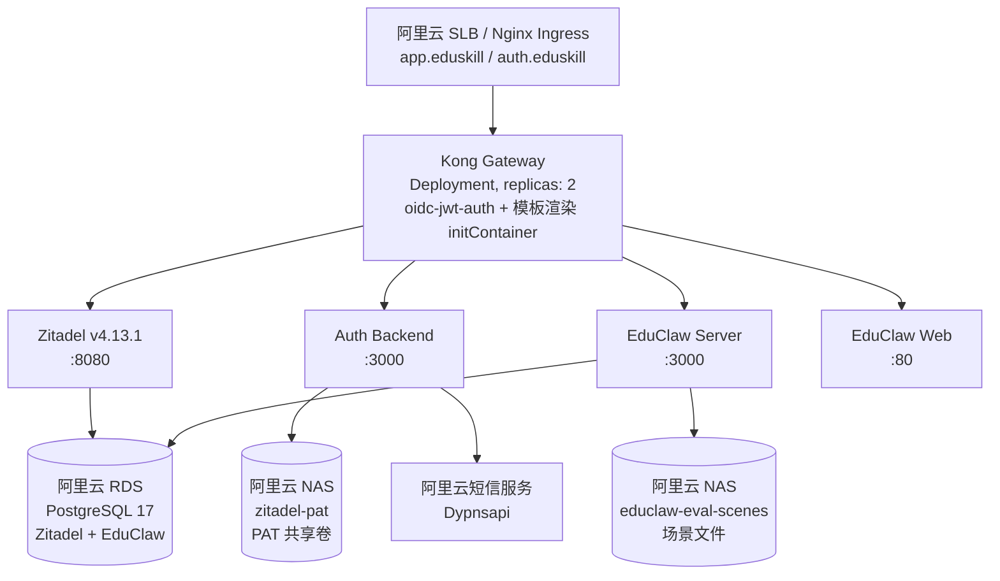

# EduClaw Arena — 阿里云 ACK 部署方案

## 架构概览



### 服务间调用关系

### 服务间调用关系

请求链路：`浏览器 → Nginx Ingress (SLB) → Kong Gateway (:8000) → 后端服务`

Kong 路由规则：

| 路径                            | Host 条件         | 目标服务         | 端口 |
| ------------------------------- | ----------------- | ---------------- | ---- |
| `/`                           | `auth.eduskill` | Zitadel          | 8080 |
| `/ui/v2/login`                | `auth.eduskill` | Zitadel Login UI | 3000 |
| `/auth`, `/sms/send`        | 无限制            | auth-backend     | 3000 |
| `/agents`, `/api`, `/llm` | `app.eduskill`  | educlaw-server   | 3000 |
| `/`                           | `app.eduskill`  | educlaw-web      | 80   |

> educlaw-web 的 nginx 会将 `/auth`、`/api` 等 API 请求反向代理到 educlaw-server，静态资源由自身直接返回。
>
> **跨命名空间通信**：Kong（`gateway` 命名空间）通过 `<service>.<namespace>.svc.cluster.local` 访问 `educlaw` 命名空间中的服务。例如，Kong 路由到 `educlaw-server.educlaw.svc.cluster.local:3000`。

### 关键决策

| 决策     | 方案                               | 原因                                                       |
| -------- | ---------------------------------- | ---------------------------------------------------------- |
| 数据库   | 阿里云 RDS PostgreSQL 17（主备）   | 托管、自动备份、高可用，比容器化可靠                       |
| 网关     | Kong 3.6 + 自定义 OIDC 插件        | 成熟 API 网关，Lua 插件性能好                              |
| 身份认证 | Zitadel v4.13.1                    | OIDC 标准，支持 SMS / 密码登录                             |
| 文件存储 | 阿里云 NAS（极速型，两个独立 PVC） | ReadWriteMany，zitadel-pat 与 educlaw-eval-scenes 隔离挂载 |
| 镜像仓库 | ACR 个人版（上海）                 | 已有账号，内网拉取快                                       |
| 入口     | Nginx Ingress Controller           | 灵活的路由注解                                             |

---

## 一、ACK 集群规划

### 1.1 集群配置

| 配置项          | 推荐值                     | 说明               |
| --------------- | -------------------------- | ------------------ |
| Kubernetes 版本 | ≥ 1.28                    |                    |
| 节点规格        | ecs.g7.xlarge (4C16G) × 3 | 生产建议 3 节点起  |
| 操作系统        | Alibaba Cloud Linux 3      | 兼容性最佳         |
| 容器运行时      | containerd 1.6+            |                    |
| 网络插件        | Terway                     | 支持 NetworkPolicy |
| API Server 访问 | 公网（白名单）             | 便于远程管理       |
| 服务发现        | CoreDNS                    | 默认即可           |

### 1.2 组件安装

集群创建后，安装以下 ACK 组件：

```bash
# 1. 安装 nginx-ingress-controller
#    阿里云控制台 → 集群 → 组件管理 → 安装 nginx-ingress-controller

# 2. 安装 NAS CSI 驱动（如果需要 NAS 存储）
#    控制台 → 组件管理 → 安装 csi-plugin + csi-provisioner

# 3. （可选）安装 cert-manager
# kubectl apply -f https://github.com/cert-manager/cert-manager/releases/download/v1.14.0/cert-manager.yaml
```

### 1.3 资源预估

| 服务           | Replicas     | CPU Request    | Mem Request      | CPU Limit    | Mem Limit         |
| -------------- | ------------ | -------------- | ---------------- | ------------ | ----------------- |
| Zitadel        | 1            | 250m           | 512Mi            | 2            | 4Gi               |
| Zitadel Login  | 1            | 250m           | 512Mi            | 2            | 4Gi               |
| auth-backend   | 2            | 250m           | 256Mi            | 2            | 1Gi               |
| Kong           | 2            | 250m           | 512Mi            | 2            | 2Gi               |
| educlaw-server | 2            | 500m           | 512Mi            | 2            | 2Gi               |
| educlaw-web    | 2            | 100m           | 64Mi             | 1            | 256Mi             |
| **总计** | **10** | **1.85** | **~2.4Gi** | **11** | **~13.3Gi** |

> 加上系统组件（CoreDNS、kube-proxy、ingress-controller、CSI），建议 **3 节点 × 4C16G**，预留约 20% 余量。

---

## 二、云资源准备

### 2.1 RDS PostgreSQL

**创建实例**（阿里云控制台 → RDS → 创建实例）：

| 配置   | 推荐值                                                  |
| ------ | ------------------------------------------------------- |
| 版本   | PostgreSQL 17                                           |
| 规格   | pg.x4.medium.2c (2C8G)，生产建议 pg.x4.large.2c (4C16G) |
| 存储   | ESSD PL1，100GB 起                                      |
| 高可用 | 主备版（一主一备）                                      |
| 网络   | 与 ACK 集群同一 VPC                                     |
| 白名单 | 添加 ACK 节点/ Pod 网段                                 |

**初始化数据库**（通过 DMS 或 psql 连接）：

```sql
-- Zitadel 库（如果尚未创建，Zitadel init Job 会自动建表）
CREATE DATABASE educlaw OWNER admin;

-- EduClaw 业务库
CREATE USER educlawlite WITH PASSWORD '<强密码>';
CREATE DATABASE educlawlite OWNER educlawlite;
GRANT ALL PRIVILEGES ON DATABASE educlawlite TO educlawlite;
```

> **注意**：EduClaw Server 启动时只检查数据库连接，不会自动创建或修改表结构。首次部署或表结构变化后，需要手动执行“EduClaw 数据库表初始化”步骤。

### 2.2 NAS 文件存储

**创建文件系统**（阿里云控制台 → NAS → 创建文件系统）：

| 配置   | 推荐值                   |
| ------ | ------------------------ |
| 类型   | 极速型 NAS               |
| 协议   | NFS v3                   |
| 容量   | 100GB（按量付费）        |
| VPC    | 与 ACK 集群同 VPC        |
| 挂载点 | 记录供 StorageClass 使用 |

NAS 上需要创建两个独立的 PVC（对应不同目录，挂载到不同容器）：

| PVC 名称                | NAS 子目录               | 挂载到         | 挂载路径                      | 用途                 |
| ----------------------- | ------------------------ | -------------- | ----------------------------- | -------------------- |
| `zitadel-pat`         | `zitadel-bootstrap/`   | auth-backend   | `/zitadel/bootstrap`        | Zitadel PAT 文件共享 |
| `educlaw-eval-scenes` | `educlaw-eval-scenes/` | educlaw-server | `/data/educlaw-eval-scenes` | 对话评估场景文件     |

> **安全说明**：两个 PVC 在 K8s 层面完全隔离——educlaw-server 容器无法访问 `zitadel-pat` PVC，auth-backend 容器也无法访问 `educlaw-eval-scenes` PVC。PAT 文件不会通过评估场景目录泄露。
>
> ⚠️ **底层存储注意**：如果两个 PVC 使用相同的 NAS StorageClass，它们可能在同一个 NAS 实例的不同子目录下。虽然 K8s 限制容器只能看到各自挂载的路径，但应确保 NAS 实例级别的目录权限正确配置，避免跨目录访问。建议在生产环境中为 PAT 敏感数据使用独立的 NAS 实例或加密卷。

### 2.3 ACR 镜像仓库

现有 ACR 信息：

| 项目        | 值                                                             |
| ----------- | -------------------------------------------------------------- |
| 地址        | `crpi-a4e25wq5oddt3z3b.cn-shanghai.personal.cr.aliyuncs.com` |
| 命名空间    | `educlaw`                                                    |
| 类型        | 个人版                                                         |
| 拉取 Secret | `mi`（已在 gateway 集群中创建）                              |

> 如果 `mi` Secret 尚未在 `educlaw` 命名空间中创建：
>
> ```bash
> kubectl create secret docker-registry mi \
>   --namespace=educlaw \
>   --docker-server=crpi-a4e25wq5oddt3z3b.cn-shanghai.personal.cr.aliyuncs.com \
>   --docker-username=<ACR用户名> \
>   --docker-password=<ACR密码>
> ```

---

## 三、镜像构建与推送

### 3.1 auth-backend

```bash
cd <auth-service-repo-path>

docker build --platform linux/amd64 \
  -t crpi-a4e25wq5oddt3z3b.cn-shanghai.personal.cr.aliyuncs.com/educlaw/eduskill-auth:latest \
  -f auth-backend/Dockerfile .

docker push crpi-a4e25wq5oddt3z3b.cn-shanghai.personal.cr.aliyuncs.com/educlaw/eduskill-auth:latest
```

### 3.2 educlaw-server

```bash
cd <EduClaw-arena-repo-path>

docker build --platform linux/amd64 \
  -t crpi-a4e25wq5oddt3z3b.cn-shanghai.personal.cr.aliyuncs.com/educlaw/eduskill-server:latest \
  -f educlaw-server/Dockerfile .

docker push crpi-a4e25wq5oddt3z3b.cn-shanghai.personal.cr.aliyuncs.com/educlaw/eduskill-server:latest
```

### 3.3 educlaw-web

```bash
cd <EduClaw-arena-repo-path>

docker build --platform linux/amd64 \
  -t crpi-a4e25wq5oddt3z3b.cn-shanghai.personal.cr.aliyuncs.com/educlaw/eduskill-web:latest \
  -f educlaw-web/Dockerfile .

docker push crpi-a4e25wq5oddt3z3b.cn-shanghai.personal.cr.aliyuncs.com/educlaw/eduskill-web:latest
```

---

## 四、配置准备

### 4.1 编辑 Secrets

部署前必须编辑 `k8s/educlaw-secrets.yaml`，将 `<...>` 占位符替换为真实值：

```yaml
stringData:
  # RDS 连接串（需先在 RDS 实例上创建 educlawlite 库和用户）
  DATABASE_URL: "postgres://educlawlite:<密码>@<RDS实例地址>.pg.rds.aliyuncs.com:5432/educlawlite"

  INVITE_CODE: "EduSkill2026"

  # Moonshot / Kimi API Key
  LLM_API_KEY: "<API Key>"

  # 阿里云短信（用于 SMS 登录）—— 可选
  ALIYUN_ACCESS_KEY_ID: "<RAM AK>"
  ALIYUN_ACCESS_KEY_SECRET: "<RAM SK>"
  ALIYUN_SMS_SIGN_NAME: "<签名>"
  ALIYUN_SMS_TEMPLATE_CODE: "<模板Code>"
```

### 4.2 配置文件对照表

| 环境变量                     | 来源            | 消费者         | 说明                          |
| ---------------------------- | --------------- | -------------- | ----------------------------- |
| `DATABASE_URL`             | educlaw-secrets | educlaw-server | RDS 连接串                    |
| `INVITE_CODE`              | educlaw-secrets | educlaw-server | 注册邀请码                    |
| `LLM_API_KEY`              | educlaw-secrets | educlaw-server | LLM API Key                   |
| `ALIYUN_*`                 | educlaw-secrets | auth-backend   | 短信凭证                      |
| `NODE_ENV`                 | educlaw-config  | educlaw-server | 生产模式                      |
| `PORT`                     | educlaw-config  | educlaw-server | 监听端口                      |
| `LLM_BASE_URL`             | educlaw-config  | educlaw-server | LLM API 地址                  |
| `LLM_MODEL`                | educlaw-config  | educlaw-server | 模型名                        |
| `APP_ORIGIN`               | educlaw-config  | educlaw-server | CORS 前端域名                 |
| `ZITADEL_ISSUER`           | educlaw-config  | auth-backend   | OIDC Issuer（外部可访问地址） |
| `ZITADEL_INTERNAL_ISSUER`  | educlaw-config  | auth-backend   | OIDC Issuer（集群内部地址）   |
| `ZITADEL_CLIENT_ID`        | educlaw-config  | auth-backend   | OIDC Client ID                |
| `ZITADEL_SERVICE_PAT_FILE` | 硬编码          | auth-backend   | PAT 文件路径                  |
| `API_UPSTREAM`             | 硬编码          | educlaw-web    | nginx 反向代理目标            |

---

## 五、部署

> **kubeconfig**：所有命令使用 `--kubeconfig ~/.kube/hk-ack.config`，或先 `export KUBECONFIG=~/.kube/hk-ack.config`。
>
> **命名空间**：Zitadel、Kong、auth-backend 部署在 `gateway` 命名空间；EduClaw 服务部署在 `educlaw` 命名空间。

### 5.1 部署顺序

| 阶段 | 资源                                                       | 命名空间 | 状态           |
| ---- | ---------------------------------------------------------- | -------- | -------------- |
| 0    | Namespace + Secrets + zitadel-pat PVC                      | gateway  | 已部署         |
| 1    | Zitadel init Job → setup Job → start Deployment          | gateway  | 已部署         |
| 2    | Zitadel Login UI + Kong                                    | gateway  | 已部署         |
| 3    | auth-backend Deployment                                    | gateway  | 已部署         |
| 4    | educlaw-secrets + educlaw-config + educlaw-eval-scenes PVC | educlaw  | **新增** |
| 5    | educlaw-server Deployment                                  | educlaw  | **新增** |
| 6    | educlaw-web Deployment                                     | educlaw  | **新增** |
| 7    | Ingress                                                    | educlaw  | **新增** |

### 5.2 前置检查

```bash
# 指定 kubeconfig
export KUBECONFIG=~/.kube/hk-ack.config

# 确认 kubectl 连接正确
kubectl cluster-info

# 确认命名空间存在
kubectl get ns gateway
kubectl get ns educlaw

# 确认 Zitadel 已启动且 PAT 文件已生成
kubectl exec -n gateway deploy/zitadel -- ls -la /zitadel/bootstrap/login-client.pat

# 确认 Kong 已启动
kubectl get pods -n gateway -l app=kong

# 确认 auth-backend 已启动
kubectl get pods -n gateway -l app=inno-agent-auth

# 确认 RDS 可连通（从集群内测试）
kubectl run pg-test --rm -it --image=postgres:17 --restart=Never -n educlaw -- \
  psql -h <RDS实例地址>.pg.rds.aliyuncs.com -U admin -d educlaw -c "SELECT 1"
```

### 5.3 执行部署

```bash
cd <EduClaw-arena-repo-path>

# 1. 基础配置
kubectl apply -f k8s/educlaw-secrets.yaml -n educlaw
kubectl apply -f k8s/educlaw-config.yaml -n educlaw
kubectl apply -f k8s/educlaw-pvc.yaml -n educlaw

# 2. educlaw-server
kubectl apply -f k8s/educlaw-server.yaml -n educlaw

# 2.1 手动初始化 EduClaw 数据库表（首次部署或表结构变化后执行）
kubectl rollout status deployment/educlaw-server -n educlaw
kubectl exec -n educlaw deploy/educlaw-server -- \
  node dist/educlaw-server/src/scripts/init-db.js

# 2.2 init-db 脚本会同步执行表结构迁移，包括 JSON 文本列转 JSONB。
# 如需通过 psql/DMS 明确执行迁移 SQL，可执行：
# ALTER TABLE agent_package_versions ALTER COLUMN snapshot_json TYPE jsonb USING snapshot_json::jsonb;
# ALTER TABLE arena_runs ALTER COLUMN report_json DROP DEFAULT;
# ALTER TABLE arena_runs ALTER COLUMN report_json TYPE jsonb USING report_json::jsonb;
# ALTER TABLE arena_runs ALTER COLUMN report_json SET DEFAULT '{}'::jsonb;
# ALTER TABLE optimization_runs ALTER COLUMN result_json DROP DEFAULT;
# ALTER TABLE optimization_runs ALTER COLUMN result_json TYPE jsonb USING result_json::jsonb;
# ALTER TABLE optimization_runs ALTER COLUMN result_json SET DEFAULT '{}'::jsonb;
# ALTER TABLE interactive_optimization_sessions ALTER COLUMN messages_json DROP DEFAULT;
# ALTER TABLE interactive_optimization_sessions ALTER COLUMN messages_json TYPE jsonb USING messages_json::jsonb;
# ALTER TABLE interactive_optimization_sessions ALTER COLUMN messages_json SET DEFAULT '[]'::jsonb;
# ALTER TABLE interactive_optimization_sessions ALTER COLUMN issues_json DROP DEFAULT;
# ALTER TABLE interactive_optimization_sessions ALTER COLUMN issues_json TYPE jsonb USING issues_json::jsonb;
# ALTER TABLE interactive_optimization_sessions ALTER COLUMN issues_json SET DEFAULT '[]'::jsonb;
# ALTER TABLE interactive_optimization_sessions ALTER COLUMN adopted_json DROP DEFAULT;
# ALTER TABLE interactive_optimization_sessions ALTER COLUMN adopted_json TYPE jsonb USING adopted_json::jsonb;
# ALTER TABLE interactive_optimization_sessions ALTER COLUMN adopted_json SET DEFAULT '[]'::jsonb;
# ALTER TABLE auto_eval_specs ALTER COLUMN questions_json DROP DEFAULT;
# ALTER TABLE auto_eval_specs ALTER COLUMN questions_json TYPE jsonb USING questions_json::jsonb;
# ALTER TABLE auto_eval_specs ALTER COLUMN questions_json SET DEFAULT '[]'::jsonb;
# ALTER TABLE auto_eval_specs ALTER COLUMN dimensions_json DROP DEFAULT;
# ALTER TABLE auto_eval_specs ALTER COLUMN dimensions_json TYPE jsonb USING dimensions_json::jsonb;
# ALTER TABLE auto_eval_specs ALTER COLUMN dimensions_json SET DEFAULT '[]'::jsonb;
# ALTER TABLE auto_eval_runs ALTER COLUMN questions_json DROP DEFAULT;
# ALTER TABLE auto_eval_runs ALTER COLUMN questions_json TYPE jsonb USING questions_json::jsonb;
# ALTER TABLE auto_eval_runs ALTER COLUMN questions_json SET DEFAULT '[]'::jsonb;
# ALTER TABLE auto_eval_runs ALTER COLUMN report_json DROP DEFAULT;
# ALTER TABLE auto_eval_runs ALTER COLUMN report_json TYPE jsonb USING report_json::jsonb;
# ALTER TABLE auto_eval_runs ALTER COLUMN report_json SET DEFAULT '{}'::jsonb;

# 3. educlaw-web
kubectl apply -f k8s/educlaw-web.yaml -n educlaw

# 4. Ingress
kubectl apply -f k8s/ingress.yaml -n educlaw
```

### 5.4 部署验证

```bash
# 1. 检查 gateway 命名空间 Pod 状态（Zitadel / Kong / auth-backend）
kubectl get pods -n gateway

# 预期输出（全部 Running）：
# NAME                               READY   STATUS    RESTARTS   AGE
# zitadel-xxx                        1/1     Running   0          1d
# zitadel-login-xxx                  1/1     Running   0          1d
# kong-xxx                           1/1     Running   0          1d
# inno-agent-auth-xxx                1/1     Running   0          1d

# 2. 检查 educlaw 命名空间 Pod 状态
kubectl get pods -n educlaw

# 预期输出（全部 Running）：
# NAME                              READY   STATUS    RESTARTS   AGE
# educlaw-server-xxx                1/1     Running   0          1m
# educlaw-web-xxx                   1/1     Running   0          1m

# 3. 检查健康端点
kubectl exec -n educlaw deploy/educlaw-server -- \
  wget -qO- http://localhost:3000/healthz

# 4. 检查 Ingress
kubectl get ingress -n educlaw

# 5. 测试 Kong 路由（从集群内）
kubectl exec -n gateway deploy/kong -- \
  wget -qO- --header="Host: app.eduskill" http://localhost:8000/

# 6. 查看日志
kubectl logs -n educlaw -l app=educlaw-server --tail=50
```

---

## 六、网络与域名

### 6.1 当前域名配置

本方案使用本地测试域名（通过 `/etc/hosts` 或 DNS 解析到 Ingress SLB IP）：

| 域名              | 用途         | Kong 路由                 |
| ----------------- | ------------ | ------------------------- |
| `app.eduskill`  | EduClaw 应用 | educlaw-web + educlaw-api |
| `auth.eduskill` | 认证服务     | Zitadel + auth-backend    |

### 6.2 生产域名切换

要切换到其他域名，需要修改以下位置：

| 位置                                                      | 当前值                                     | 需改为（示例）                                                 |
| --------------------------------------------------------- | ------------------------------------------ | -------------------------------------------------------------- |
| `educlaw-config.yaml` → `APP_ORIGIN`                 | `http://app.eduskill`                    | `http://app.example.com`                                     |
| `educlaw-config.yaml` → `ZITADEL_ISSUER`             | `http://auth.eduskill`                   | `http://auth.example.com`                                    |
| `educlaw-config.yaml` → `ZITADEL_LOGIN_REDIRECT_URI` | `http://auth-backend:3000/auth/callback` | 保持不变（集群内部回调）                                       |
| `ingress.yaml` → `host`                              | `app.eduskill`                           | `app.example.com`                                            |
| `ingress.yaml` → `host`                              | `auth.eduskill`                          | `auth.example.com`                                           |
| Kong ConfigMap →`kong.yml` 中的 hosts                  | `__KONG_APP_HOST__` 等                   | 由 initContainer 模板渲染，修改`kong.yaml` Deployment 的 env |
| Zitadel ConfigMap →`ExternalDomain`                    | `auth.eduskill`                          | `auth.example.com`                                           |

> ⚠️ **注意**：Zitadel 的 issuer URL 设定后不能更改，否则已签发的所有 JWT Token 将失效。切换前务必备份数据库。

---

## 七、运维手册

### 7.1 查看日志

```bash
# EduClaw 服务日志（educlaw 命名空间）
kubectl logs -n educlaw -l app=educlaw-server -f
kubectl logs -n educlaw -l app=educlaw-server --previous

# Kong 日志（gateway 命名空间）
kubectl logs -n gateway -l app=kong --tail=100

# Zitadel 日志（gateway 命名空间）
kubectl logs -n gateway -l app=zitadel --tail=100

# auth-backend 日志（gateway 命名空间）
kubectl logs -n gateway -l app=inno-agent-auth --tail=100
```

### 7.2 重启服务

```bash
# educlaw 命名空间
kubectl rollout restart deployment/educlaw-server -n educlaw
kubectl rollout restart deployment/educlaw-web -n educlaw

# gateway 命名空间
kubectl rollout restart deployment/kong -n gateway
kubectl rollout restart deployment/zitadel -n gateway
kubectl rollout restart deployment/inno-agent-auth -n gateway

# 查看滚动更新状态
kubectl rollout status deployment/educlaw-server -n educlaw
```

### 7.3 扩缩容

```bash
# 手动扩容（educlaw 命名空间）
kubectl scale deployment/educlaw-server -n educlaw --replicas=4

# 查看当前副本数
kubectl get deployments -n educlaw
kubectl get deployments -n gateway
```

### 7.4 进入容器调试

```bash
# educlaw-server（educlaw 命名空间）
kubectl exec -it -n educlaw deploy/educlaw-server -- sh

# 检查环境变量
kubectl exec -n educlaw deploy/educlaw-server -- env | sort

# Kong（gateway 命名空间）
kubectl exec -it -n gateway deploy/kong -- sh

# 测试 Kong 到 educlaw-server 的内部路由（跨命名空间）
kubectl exec -n gateway deploy/kong -- \
  wget -qO- http://educlaw-server.educlaw:3000/healthz
```

### 7.5 更新镜像

```bash
# 1. 构建新镜像并推送
docker build ... -t crpi-...educlaw/educlaw-server:v1.0.1 .
docker push crpi-...educlaw/educlaw-server:v1.0.1

# 2. 更新 Deployment 镜像
kubectl set image deployment/educlaw-server \
  educlaw-server=crpi-...educlaw/educlaw-server:v1.0.1 \
  -n educlaw

# 3. 查看更新进度
kubectl rollout status deployment/educlaw-server -n educlaw

# 4. 回滚（如需要）
kubectl rollout undo deployment/educlaw-server -n educlaw
```

### 7.6 健康检查

```bash
# gateway 命名空间服务状态
kubectl get pods -n gateway -o wide

# educlaw 命名空间服务状态
kubectl get pods -n educlaw -o wide

# 资源使用
kubectl top pods -n gateway
kubectl top pods -n educlaw
kubectl top nodes

# Events（排查问题）
kubectl get events -n gateway --sort-by='.lastTimestamp' | tail -20
kubectl get events -n educlaw --sort-by='.lastTimestamp' | tail -20
```

---

## 八、常见问题

### 8.1 Pod 一直 Pending

```bash
# 查看原因（根据 Pod 所在命名空间选择）
kubectl describe pod -n educlaw <pod-name>
kubectl describe pod -n gateway <pod-name>

# 常见原因：
# - PVC 未绑定：检查 NAS CSI 驱动是否安装，StorageClass 是否正确
# - 资源不足：检查节点资源 `kubectl top nodes`
# - 镜像拉取失败：检查 imagePullSecrets
```

### 8.2 educlaw-server 启动即 CrashLoopBackOff

```bash
kubectl logs -n educlaw -l app=educlaw-server --previous

# 常见原因：
# - DATABASE_URL 不对或 RDS 不可达（白名单）
# - LLM_API_KEY 未设置
# - 首次部署后未手动执行 EduClaw 数据库表初始化脚本
```

### 8.3 Kong 返回 502 Bad Gateway

```bash
# 确认 upstream 服务正常运行
kubectl get endpoints -n gateway
kubectl get endpoints -n educlaw

# 确认 Kong 路由配置正确（跨命名空间访问 educlaw-server）
kubectl exec -n gateway deploy/kong -- \
  wget -qO- http://educlaw-server.educlaw:3000/healthz

# 确认 Service 的 selector 与 Pod labels 匹配
kubectl describe service educlaw-server -n educlaw
```

### 8.4 Zitadel init / setup Job 失败

```bash
# 查看 Job 日志
kubectl logs -n gateway job/zitadel-init
kubectl logs -n gateway job/zitadel-setup

# 常见原因：
# - RDS 连接失败（检查白名单、安全组）
# - 数据库已存在（init 幂等，不会失败）
# - Masterkey 不正确
# - Init Steps YAML 格式错误

# 重置（如果需要完全重来）：
kubectl delete job zitadel-init zitadel-setup -n gateway
kubectl delete pvc zitadel-pat -n gateway
kubectl apply -f <auth-service>/k8s/init.yaml -n gateway
kubectl apply -f <auth-service>/k8s/setup.yaml -n gateway
```

### 8.5 auth-backend 读不到 PAT 文件

```bash
# 确认 PAT 文件存在（gateway 命名空间）
kubectl exec -n gateway deploy/zitadel -- ls -la /zitadel/bootstrap/

# 确认 auth-backend 已挂载 PVC
kubectl exec -n gateway deploy/inno-agent-auth -- ls -la /zitadel/bootstrap/

# 如果一个 Pod 能看到另一个看不到：PVC 的 accessMode 必须是 ReadWriteMany
kubectl get pvc zitadel-pat -n gateway
```

---

## 九、备份策略

### 9.1 RDS 数据库

- **自动备份**：RDS 控制台配置自动备份策略（建议每天凌晨）
- **手动备份**：
  ```bash
  # 在 RDS 控制台或通过 CLI
  aliyun rds CreateBackup --DBInstanceId=<实例ID> --BackupMethod=Logical
  ```

### 9.2 NAS 文件

- **`zitadel-pat` PVC**（PAT 文件）：通过 NAS 快照功能备份
- **`educlaw-eval-scenes` PVC**（评估场景）：定期同步到 OSS
  ```bash
  # 在定时任务 Pod 中运行
  aliyun oss sync /mnt/nas/educlaw-eval-scenes/ oss://educlaw-backup/eval-scenes/
  ```
- 注意：两个 PVC 相互隔离，备份时需分别处理

### 9.3 Kubernetes 资源

```bash
# 导出 gateway 命名空间资源
kubectl get all,configmap,secret,ingress,pvc -n gateway -o yaml > backup-gateway-$(date +%Y%m%d).yaml

# 导出 educlaw 命名空间资源
kubectl get all,configmap,secret,ingress,pvc -n educlaw -o yaml > backup-educlaw-$(date +%Y%m%d).yaml
```

---

## 十、后续优化建议

| 优先级 | 项目          | 说明                                                             |
| ------ | ------------- | ---------------------------------------------------------------- |
| 高     | HPA 自动伸缩  | 为`educlaw-server` 和 `auth-backend` 配置基于 CPU/Mem 的 HPA |
| 高     | 日志收集      | 接入阿里云 SLS，Pino 输出 JSON 格式                              |
| 高     | 监控告警      | 接入 ARMS Prometheus，监控 4xx/5xx 率和延迟                      |
| 中     | CI/CD         | ACR 自动构建 + GitOps（ArgoCD）自动部署                          |
| 中     | IRSA          | 用 RAM Role + OIDC 替代 AccessKey 访问短信服务                   |
| 中     | 生产域名      | 切换到真实域名                                                   |
| 低     | 节点池分离    | 核心服务（Zitadel/Kong）用固定节点池，业务服务用弹性节点池       |
| 低     | NetworkPolicy | 限制跨服务通信，只开放必要端口                                   |
