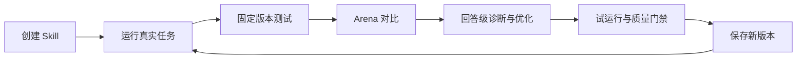
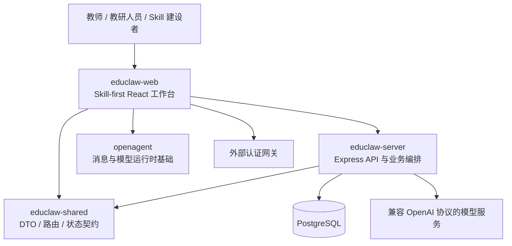

# EduSkill 平台说明与功能地图

> 文档用途：帮助产品、研发、汇报材料编写者和 AI 助手快速理解 EduSkill 是什么、当前已经具备什么能力，以及哪些内容仍在开发或规划中。  
> 最近核对：2026-08-15  
> 事实优先级：当前代码与激活路由 > 当前产品设计文档 > 历史技术报告。

## 1. 一句话定位

**EduSkill 是一个面向教育场景的 Skill 创建、使用、评测、优化与版本治理平台。**

它把教师和教研人员在备课、教学设计、学习支持、评价与研究中的工作方法，从一次性提示词或临时对话，沉淀为可运行、可测试、可优化、可追溯、可复用的 Skill 数字资产。

EduSkill 当前的核心对象是 **Skill**，不是通用 Agent，也不是模型训练或知识库平台。

## 2. 平台解决的问题

教育工作中使用生成式 AI，常见问题不是“模型不会回答”，而是：

- 同类任务每次都要重新说明目标、对象、步骤和格式；
- 教师经验停留在个人对话中，难以复用和协作；
- 输出缺少稳定标准，无法判断改动是否真的更好；
- 修改过程不可追溯，好的版本难以保留和恢复；
- 单次回答出现问题时，很难反推应该修改哪个 Skill、哪一段规则。

EduSkill 将这些问题组织成一个连续闭环：



## 3. 核心概念

### 3.1 Skill

Skill 是平台中可复用、可维护的教育能力单元。一个 Skill 描述：

- 服务对象与使用场景；
- 要完成的核心任务；
- 输入与输出约定；
- 工作步骤、教育策略和处理规则；
- 知识依据、适用边界和异常处理；
- 完成标准与效果证据。

Skill 的主要内容以标准 `SKILL.md` 保存，包含 YAML frontmatter、名称、描述和正文规则。

### 3.2 Package

Package 是当前后端的数据与交付容器，可以包含：

- `agent.md`：包级角色或运行说明；
- `rubric.md`：评价维度与标准；
- `skills/<dir-name>/SKILL.md`：一个或多个 Skill；
- 包和 Skill 的版本快照、元数据与关联关系。

产品界面已经以 Skill 为中心；Package 仍是底层存储、接口兼容和 ZIP 导入导出的重要边界。

### 3.3 Skill Version

每次确认生成、手动修改、交互式优化或回退都会形成版本记录。版本具有以下特征：

- 版本内容可预览、比较和追溯；
- 回退不会覆盖历史，而是基于旧版本创建一个新版本；
- 非当前版本可以废弃，废弃后仍可恢复；
- 运行、测试和 Arena 可以绑定明确的 Skill Version。

### 3.4 Conversation / Arena Thread

Conversation 是在某个 Skill 下完成具体任务的对话记录。一个 Skill 可以有多条对话。

Arena Thread 记录运行、测试、双版本对比和优化场景中的消息、版本绑定与回答溯源。历史回答保留当时实际使用的版本，不随当前版本变化而改写。

### 3.5 Answer Optimization Run

回答优化任务从某条真实回答出发，保留问题、上下文、回答侧、模型和所用 Skill Version 等 provenance（溯源信息），并驱动诊断、修改、试运行和版本保存。

## 4. 当前主要功能

以下功能已在当前主工作台或后端激活路由中落地。

### 4.1 Skill 创建

#### 对话共创

- 从一个教学目标或精选教育场景开始；
- 通过自然对话逐步澄清需求，而不是要求用户一次写全；
- 教育版引导流程覆盖五个步骤：
  1. 目标与对象；
  2. 教师经验与依据；
  3. 教学策略共创；
  4. 行动调整、边界与责任；
  5. 效果与证据复核；
- 支持系统建议选项、对话轮次导航和创建进度；
- 生成前展示结构化确认页；
- 用户确认后依次生成、校验并保存 Skill v1；
- 创建草稿、消息和状态持久化，可继续未完成会话。

#### 文档生成

- 上传需求说明、教学设计或其他描述文档生成 Skill；
- 支持 DOCX、Markdown、TXT、CSV、JSON、YAML 以及常见文本/代码格式；
- 每份文档独立生成一个 Skill；
- 支持最多 20 份文档的批量任务，当前前端并发数为 2；
- 可以给所有文档补充统一要求；
- 展示每份文档的等待、生成、成功或失败状态。

#### 完整填写

- 通过结构化表单输入 Skill 名称、服务对象、使用场景、核心任务、输入、输出和规则边界；
- 支持添加教学材料；
- 用户可以先填写部分内容，再进入对话继续补全遗漏。

#### ZIP 导入

- 导入标准 Skill ZIP；
- 校验 Package、Skill 文件和版本快照；
- 导入后进入 Skill 仓库并纳入后续运行、测试、优化和版本管理。

### 4.2 Skill 仓库与工作区

- Skill 仓库统一展示已生成、已导入的 Skill 和未完成草稿；
- 支持搜索、选择、打开和从当前工作区移除；
- 左侧工作区保存常用 Skill；
- 每个 Skill 下可以创建、切换、重命名和删除多条任务对话；
- 右侧上下文面板按需展示详情、运行信息、回答优化和版本摘要；
- 主路径 `/` 与 `/skills` 均进入 Skill-first 工作台。

### 4.3 Skill 使用与固定版本测试

- 使用当前或指定 Skill Version 执行真实任务；
- 运行和测试均创建可持久化的对话线程；
- 支持流式生成和多轮上下文；
- 新对话默认使用当前 Skill 的当前版本；
- 回答消息保存实际使用的版本信息；
- 运行失败不会改写已有对话，可在保留上下文的前提下重试。

“使用”与“测试”复用同一执行基础，区别主要在产品语义：使用面向真实任务，测试面向固定输入和版本验证。

### 4.4 Arena 双版本对比

- A、B 两侧可以选择不同 Skill Version；
- 一侧可以不加载 Skill，作为基础回答对照；
- 同一个问题分别生成两侧回答，直观比较处理过程和输出质量；
- 支持流式展示、完整对话记录和版本绑定；
- 服务端可生成维度评分、摘要、推荐侧和胜负结论；
- 对任一侧的回答都可以继续进入回答级优化。

### 4.5 回答级交互式 Skill 优化

这是当前 EduSkill 最具区分度的闭环能力之一。

完整流程为：

```text
选中真实回答
→ 获取改进建议或输入修改要求
→ 分析问题与目标 Skill
→ 生成 Skill 修改草稿和 Diff
→ 用户继续调整
→ 多样本试运行
→ 质量门禁
→ 确认保存为新版本
→ 用新版本重新运行原任务
```

当前能力包括：

- 从使用、测试或 Arena 的具体回答进入优化；
- 根据问题、上下文、回答和版本溯源生成改进建议；
- 诊断回答问题并定位需要调整的 Skill；
- 支持单 Skill 和多 Skill 协同修改；
- 多 Skill 任务采用批量生成、顺序确认，分别形成版本；
- 展示原始内容、优化内容和逐行 Diff；
- 支持继续用自然语言修改草稿；
- 使用多个测试样本进行试运行；
- 展示测试回答、评估说明和质量门禁通过情况；
- 当前版本变化时支持 rebase，避免覆盖最新修改；
- 只有通过校验与用户确认后才保存新版本；
- 优化任务可恢复、取消或重新开始。

### 4.6 版本管理

- 查看 Skill 版本列表和当前版本；
- 预览某一历史版本的 `SKILL.md`；
- 比较当前版本与历史版本的内容差异；
- 为版本记录来源和备注；
- 基于历史版本创建新的回退版本；
- 废弃非当前版本，并可恢复；
- Package 层仍保留完整快照、版本比较和版本回退能力；
- 支持导出标准 ZIP，便于交付和迁移。

### 4.7 平台基础能力

- 用户登录、身份校验和资源所有权隔离；
- PostgreSQL 持久化和 JSONB 版本快照；
- SSE 流式生成、心跳和错误事件；
- 幂等键与并发版本校验；
- `x-request-id` 链路标识和结构化日志；
- 前后端共享 DTO、路由常量和状态类型；
- 前端对 Markdown、代码、公式和富文本结果进行渲染。

## 5. 四条核心用户流程

### 5.1 从经验到 Skill

1. 用户选择对话共创、文档生成、完整填写或 ZIP 导入。
2. 平台提取或补全目标、对象、场景、策略、输入输出、边界和证据。
3. 用户在生成前确认 Skill 的工作方式。
4. 服务端生成并校验标准 Skill 文件。
5. 保存 Skill v1，并进入仓库和运行工作区。

### 5.2 从 Skill 到真实使用

1. 从仓库选择 Skill。
2. 新建一条任务对话。
3. 选择当前版本或指定版本。
4. 输入真实教育任务并获得流式回答。
5. 继续多轮对话，历史消息保留实际使用版本。

### 5.3 从回答问题到 Skill 改进

1. 在具体回答下选择“回答优化”。
2. 平台读取回答 provenance，恢复问题、上下文和版本。
3. 用户选择建议或描述期望改进。
4. 平台诊断并生成目标 Skill 的修改草稿。
5. 用户审阅 Diff，并可继续调整。
6. 平台运行多样本测试和质量门禁。
7. 用户确认后创建新版本。
8. 使用新版本重新执行原任务验证效果。

### 5.4 从历史版本到安全回退

1. 打开版本管理。
2. 预览或比较历史版本。
3. 选择回退目标。
4. 平台基于该历史内容创建一个新的版本。
5. 原当前版本和全部历史记录继续保留。

## 6. 当前系统架构



### 6.1 `educlaw-web`

职责：

- Skill-first 工作台；
- 创建、仓库、运行、测试、Arena、优化和版本管理界面；
- 流式事件消费、状态管理、Diff 和 Markdown 渲染；
- 用户认证状态和前端交互反馈。

关键入口：

- [`educlaw-web/src/pages/SkillFirstWorkspace.tsx`](../educlaw-web/src/pages/SkillFirstWorkspace.tsx)
- [`educlaw-web/src/components/skill-workspace`](../educlaw-web/src/components/skill-workspace)
- [`educlaw-web/src/api/lite-api.ts`](../educlaw-web/src/api/lite-api.ts)

### 6.2 `educlaw-server`

职责：

- Skill/Package 生成、导入、导出与校验；
- 引导创建会话和教育需求提炼；
- 运行、测试、Arena 消息与报告；
- 回答 provenance 和回答级优化编排；
- Skill 与 Package 版本治理；
- 数据库、模型调用、日志与错误处理。

当前 `/api` 主路由只激活以下业务组：

- `actions`：Skill 版本动作、Arena 线程动作和引导创建动作；
- `packages`：生成、导入、编辑、优化、版本与导出；
- `arena`：线程、消息、流式回答与报告；
- `answer-skill-optimizations`：建议、创建、调整、测试、rebase、确认和取消。

关键入口：

- [`educlaw-server/src/routes/index.ts`](../educlaw-server/src/routes/index.ts)
- [`educlaw-server/src/services/guided-creation-service.ts`](../educlaw-server/src/services/guided-creation-service.ts)
- [`educlaw-server/src/services/package-service.ts`](../educlaw-server/src/services/package-service.ts)
- [`educlaw-server/src/services/arena-service.ts`](../educlaw-server/src/services/arena-service.ts)
- [`educlaw-server/src/services/answer-skill-optimization-service.ts`](../educlaw-server/src/services/answer-skill-optimization-service.ts)
- [`educlaw-server/src/services/skill-version-service.ts`](../educlaw-server/src/services/skill-version-service.ts)

### 6.3 `educlaw-shared`

职责：

- 前后端共享类型；
- API 路由常量；
- Skill、版本、Arena、引导创建与回答优化的稳定契约。

关键入口：[`educlaw-shared/index.ts`](../educlaw-shared/index.ts)

### 6.4 `openagent`

职责：

- 消息规范化和文本提取；
- 模型传输与运行时上下文；
- 为前端对话能力提供通用基础，不承载 EduSkill 产品规则。

关键入口：[`openagent`](../openagent)

## 7. 功能状态边界

### 已实现并属于当前主产品

- Skill-first 工作台与 Skill 仓库；
- 对话共创、文档生成、完整填写和 ZIP 导入；
- 教育版五步引导和生成前确认；
- Skill 使用、固定版本测试和多对话；
- Arena 双版本对比；
- 回答级交互式 Skill 优化；
- Skill 版本预览、比较、回退、废弃和恢复；
- Package 快照、ZIP 导入导出和基础设施能力。

### 当前工作树正在继续完善

- 回答优化的建议生成、审阅布局和交互细节；
- 优化面板中的状态提示、Diff 展示、测试结果和重新运行体验；
- 多 Skill 优化流程的边界与可靠性测试。

此类能力已经有实现基础，但在形成对外宣传口径前应重新运行相关测试并核对最新界面。

### 已有方案、尚不能写成已上线

- 多模态 Skill Pack；
- 图片、音频、视频等资产的对象存储与异步处理；
- MinIO、媒体 Worker、证据单元和 Pack 发布流水线；
- 面向多模态材料的完整权限、审计、GC 和备份体系。

相关内容目前主要存在于设计与实施规范中，不能与现有文档/文本材料能力混为一谈。

### 兼容或历史能力，不应作为当前主产品重点

- `/legacy`、`/workflow` 等旧页面；
- `compat.ts` 中的旧 Agent/Profile/Chat 兼容接口；
- 未在当前 `/api` 主路由注册的自动评测路由；
- 旧报告中以 Agent/Package 为主要用户心智的表述。

## 8. 与历史技术报告相比，平台发生了什么变化

历史技术报告提出的主线仍然成立：

> 把教师和教研人员的工作方法转化为可运行、可测试、可优化、可版本化的数字资产。

当前平台在此基础上有三项关键演进：

1. **创建入口从单一文档驱动扩展为多入口。** 当前同时支持对话共创、文档批量生成、完整填写和 ZIP 导入。
2. **产品中心从 Agent/Package 转向 Skill。** Package 继续承担底层容器和交付边界，但用户日常操作围绕 Skill、对话和 Skill Version 展开。
3. **优化从抽象的自动优化转向真实回答驱动。** 当前强调回答 provenance、目标 Skill 定位、人工审阅、Diff、多样本试运行、质量门禁和安全保存新版本。

因此，对外介绍时应使用“教育 Skill 全生命周期平台”或“教育经验资产化平台”，不宜再仅描述为“文档生成 Skill 工具”或“通用智能体平台”。

## 9. 对外介绍的推荐表述

### 9.1 30 秒版本

EduSkill 面向教师和教研人员，把教学目标、经验、策略、规则和材料沉淀为可复用的教育 Skill。平台不仅能生成 Skill，还能让用户在真实任务中运行和比较效果，从具体回答反向优化 Skill，并通过版本管理保留每次改进，形成“创建—使用—测试—优化—复用”的完整闭环。

### 9.2 PPT 两页版本

#### 第 1 页：为什么需要 EduSkill

**标题建议：把一次性 AI 对话，沉淀为可持续进化的教育 Skill**

核心信息：

- 教师经验难沉淀；
- 同类任务重复描述；
- 输出缺少稳定标准；
- 修改效果无法验证；
- 优秀版本难复用和追溯。

结论：教育场景需要的不是更多临时提示词，而是一套 Skill 资产生产与迭代机制。

#### 第 2 页：EduSkill 提供什么

**标题建议：EduSkill 打通教育 Skill 的创建、使用、评测、优化与治理**

主流程：

```text
多方式创建
→ 真实任务运行
→ 固定版本测试 / Arena 对比
→ 回答级诊断与优化
→ 质量门禁
→ 新版本保存与复用
```

建议强调的差异点：教育化引导、真实回答溯源、人在回路确认、版本化资产沉淀。

## 10. 维护规则

当平台功能发生变化时，按以下顺序更新本文档：

1. 先核对 `educlaw-web/src/pages/SkillFirstWorkspace.tsx` 和 Skill 工作台组件，确认用户实际能看到什么；
2. 再核对 `educlaw-server/src/routes/index.ts`，确认哪些服务真正注册在当前主 API；
3. 核对共享类型和数据库结构，确认版本、状态和溯源边界；
4. 将功能标记为“已实现”“工作树开发中”或“规划中”；
5. 最后更新对外介绍和 PPT 两页版本，避免把设计稿写成已上线能力。

