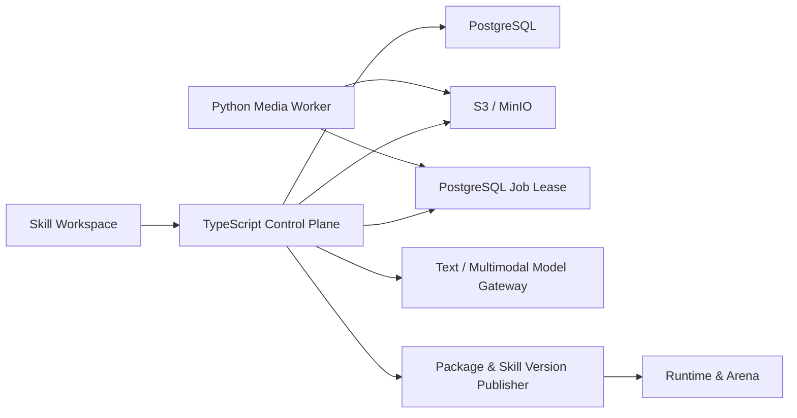

# EduSkill 多模态 Skill Pack 蒸馏与评估升级设计

## 文档状态

- 状态：待工程规范与方案审核组审核
- 日期：2026-08-14
- 适用仓库：EduSkill 当前 `arena` 工作区
- 实施原则：先建立可验证的最小闭环，再逐步扩大媒体类型和自动化程度
- 参考来源：
  - [cangjie-skill](https://github.com/kangarooking/cangjie-skill)
  - [EduClaw `feature/kongzhongketang-distill` 分支](https://github.com/ZhuoxuanLi-Research/EduClaw-arena/tree/feature/kongzhongketang-distill)

## 1. 决策摘要

本次升级建设平台原生的“多模态 Skill Pack 编译系统”，不直接合并远程分支的独立工作台，也不在生产链路中直接执行 `cangjie-skill`。

系统分为三层：

1. **Evidence Engine**：把视频、音频、文档和图片转换成可追溯的文本、关键帧、页面、OCR 和结构化证据。
2. **Skill Pack Compiler**：按照全局理解、五路抽取、候选验证、RIA++、关系组网和压力测试的流程生成多个原子 Skill。
3. **Runtime & Arena**：复用当前 Package、Skill Version 和 Arena，负责版本发布、运行时路由、多模态证据选择、A/B 评估和后续优化。

发布态映射采用：

- 一个 Skill Pack 对应一个 `agent_packages`；
- Pack 成员对应 `agent_package_skills`；
- Pack 每次发布对应新的 `agent_package_versions`；
- 成员内容或资产变化时创建新的 `agent_skill_versions`；
- 未变化的 Skill Version 按内容和资产哈希复用。

## 2. 背景与当前平台约束

### 2.1 当前能力

当前平台已经具备：

- `AgentPackageSnapshot` 和 Package Version；
- 独立 Skill 实体及 Skill Version；
- `agent_package_version_skills` 固定 Package Version 使用的 Skill Version；
- Guided Creation 的 revision、幂等、确认和失败恢复；
- Skill Arena 的固定版本运行、测试、对比和优化；
- 文档创建、对话创建、手动创建和导入入口。

### 2.2 当前缺口

`PackageSkill` 目前只保存 `skillMd`，不能版本化保存图片、页面片段或其他兄弟文件。因此远程视频蒸馏分支导入当前 Package 时只能内联文字并删除图片引用。

现有文档创建模式是一份文档独立生成一个 Skill，不具备：

- 长视频下载和转录；
- 关键帧及 PDF 页面视觉理解；
- 全局理解审核；
- 多候选抽取和淘汰；
- 多个原子 Skill 的 Pack 级关系；
- Pack 内兄弟 Skill 的路由混淆测试；
- Skill Version 与来源证据、视觉资产的不可变关联。

## 3. 目标与非目标

### 3.1 目标

1. 支持视频 URL、视频上传、音频、PDF、DOCX、Markdown 和图片作为素材。
2. 使用 Whisper 生成带时间戳转录，使用 FFmpeg 生成关键帧，使用 Kimi K2.5 等多模态模型分析关键帧和页面。
3. 所有生成结论都能回溯到时间戳、页码、区域或关键帧。
4. 一组素材可以生成多个原子 Skill，并作为一个 Skill Pack 发布。
5. 生成流程包含全局理解、五路抽取、V0/V1/V2/V3、RIA++、关系组网和压力测试。
6. 将 RIA++ 映射到平台现有七维教育模型。
7. 运行时可以在选中 Skill 后动态加载相关视觉证据。
8. Arena 能评估 Pack 路由、Skill 执行质量和视觉证据忠实度。
9. 支持幂等、断点恢复、版本回滚、素材删除和审计。

### 3.2 非目标

第一版不建设：

- 直接将整段视频发送给视频大模型；
- DRM、付费或登录受限媒体绕过；
- 音色情感、语速和声学教学行为分析；
- 自动执行模型生成的任意代码；
- 无人工确认的自动发布；
- 自动覆盖已发布 Skill Version；
- 独立于当前 Skill Workspace 的 iframe 产品；
- 第一版引入独立向量数据库。

## 4. 参考能力的吸收边界

### 4.1 从 `kongzhongketang-distill` 吸收

复用或重构以下 MIT 侧代码思路：

- 视频来源识别和下载；
- Faster Whisper 转录及 JSON/TXT/SRT 输出；
- 字幕视觉提示、镜头变化和周期采样混合抽帧；
- 文本基线分析加短视觉增强；
- `frame_id` 白名单校验；
- 输入指纹、Prompt 版本和检查点恢复；
- 视觉证据随 Skill 打包；
- 多模态回答和匿名 A/B 的基本思路。

不引入以下部分：

- Python `LibraryStore` 和 `JobStore` 作为业务事实来源；
- 独立 Project 领域模型；
- 独立 frontend 和 iframe workbench；
- 通过 ZIP 桥导入后删除图片；
- Python 线程作为生产任务队列。

### 4.2 从 `cangjie-skill` 吸收

重新实现以下方法，不复制 AGPL 模板文本：

- Source Overview；
- Framework、Principle、Case、Counterexample、Glossary 五路抽取；
- V1 可迁移性、V2 预测力、V3 独特性；
- R、I、A1、A2、E、B 编译结构；
- `depends_on`、`contrasts_with`、`composes_with` 关系；
- should-trigger、should-not-trigger、edge、sibling-confusion 测试；
- Overview、Glossary、Digest、Index、verified、rejected 审计产物。

### 4.3 我们的增强

在两套参考之上增加：

- V0 证据真实性验证；
- 统一 Evidence Graph；
- 视频全局抽帧和候选导向二次抽帧；
- PDF 页面、图表和页内区域视觉证据；
- Skill Version 级不可变资产；
- RIA++ 与七维教育模型双结构；
- Pack 级路由评估；
- 版本固定的自动评估和回答证据追踪。

## 5. 总体架构



### 5.1 TypeScript 控制面

负责用户权限、领域状态、工作流、Prompt 编排、模型调用、候选决策、发布事务、测试和审计。PostgreSQL 是唯一业务事实来源。

### 5.2 Python Media Worker

只执行媒体确定性处理：下载、探测、转码、转录、抽帧、OCR、PDF 页面渲染和派生文件上传。工作器不创建 Pack、Candidate、Skill 或 Package。

### 5.3 对象存储

原始媒体和派生二进制文件进入 S3 兼容存储。开发环境使用 MinIO 或 LocalBlobStore。数据库和 Package Snapshot 只保存不可变清单与哈希，不保存临时签名 URL。

### 5.4 模型网关

扩展当前 `llm-service.ts` 的消息类型，使 `content` 支持文本和 `image_url` 部件。Kimi K2.5 作为首选视觉模型，仍允许通过配置替换。中转网关必须通过启动探针验证图片输入，验证失败时阻止启动多模态蒸馏任务。

## 6. 核心领域模型

### 6.1 Skill Pack

创作态容器，保存素材、运行、阶段产物、候选、关系和测试。首次发布后绑定一个 `agent_package_id`。

### 6.2 Asset

原始素材或派生二进制对象。Asset 以 SHA-256 标识内容，存储键不可变。删除原始 Pack 时，仍被已发布 Skill Version 引用的对象不得物理删除。

### 6.3 Evidence Unit

最小证据单元：

```ts
interface SkillEvidenceUnit {
  id: string;
  packId: string;
  assetId: string;
  modality: "transcript" | "frame" | "page_text" | "page_image" | "ocr";
  locator: {
    startSeconds?: number;
    endSeconds?: number;
    page?: number;
    frameId?: string;
    region?: { x: number; y: number; width: number; height: number };
  };
  content: string;
  observation: string | null;
  sourceKind:
    | "source_explicit"
    | "model_observed"
    | "model_inferred"
    | "user_confirmed";
  confidence: number | null;
  assetSha256: string | null;
}
```

规则：

- `source_explicit` 只用于原始字幕、原文或 OCR；
- `model_observed` 只描述画面直接可见内容；
- `model_inferred` 不能单独通过 V0；
- `user_confirmed` 保留确认人和确认时间；
- 字幕和同一事件画面不能被 V1 当作两份独立语境。

### 6.4 Artifact

每个编译阶段的不可变输出，包含输入指纹、Prompt 版本、模型、结构化 JSON、渲染 Markdown 和审核状态。

### 6.5 Candidate

候选类型包括 `framework`、`principle`、`case`、`counterexample`、`glossary`。只有 framework 和 principle 默认可进入 Skill 编译；其余分别作为 A1、B 和共享术语材料。

## 7. 数据库设计

新增表：

### 7.1 `skill_packs`

```sql
create table skill_packs (
  id bigserial primary key,
  user_id text not null,
  title text not null,
  description text not null default '',
  status text not null,
  current_run_id bigint,
  agent_package_id bigint references agent_packages(id) on delete set null,
  revision_no integer not null default 0,
  created_at timestamptz not null default now(),
  updated_at timestamptz not null default now(),
  published_at timestamptz
);
```

状态限制为：

```text
draft_sources
processing_sources
overview_review
extracting_candidates
candidate_review
compiling_skills
validating_pack
publish_review
publishing
published
failed
cancelled
```

### 7.2 `skill_pack_assets`

保存原始和派生 Asset 元数据：kind、mime、storage_key、sha256、大小、时长、页数、处理状态和 metadata JSON。

### 7.3 `skill_evidence_units`

保存 modality、locator JSON、content、observation、source_kind、confidence、storage_key 和哈希。

### 7.4 `skill_pack_runs`

保存 current_stage、pipeline_version、input_fingerprint、模型配置、lease、attempt、retry 和 error。

### 7.5 `skill_pack_artifacts`

`artifact_type` 支持：

```text
source_overview
framework_candidates
principle_candidates
cases
counterexamples
glossary
verified_candidates
rejected_candidates
skill_drafts
relation_graph
digest
test_plan
test_report
```

### 7.6 `skill_candidates`

保存候选正文、类型、状态、验证结果、合并目标和用户决策。

### 7.7 `skill_pack_members`

关联 pack、candidate、skill 和 pinned skill version，记录排序与成员状态。

### 7.8 `skill_assets` 与 `agent_skill_version_assets`

`skill_assets` 保存不可变对象清单；`agent_skill_version_assets` 将具体 Skill Version 固定到具体资产。

### 7.9 `skill_evidence_links`

将 Skill Version 与 Evidence Unit 关联，role 限制为 `reading`、`case`、`boundary`、`visual`、`reference`。

### 7.10 `skill_pack_relations`

关系限制为 `depends_on`、`contrasts_with`、`composes_with`，并保存 reason。

### 7.11 测试表

- `skill_test_cases`
- `skill_test_runs`
- `skill_test_results`
- `skill_test_result_routes`

所有测试运行固定 Pack Version、Skill Version、模型、Prompt Version 和资产哈希。

## 8. 共享类型升级

`PackageVersion.source` 增加 `distilled`。

`PackageSkill` 向后兼容增加：

```ts
interface SkillAssetManifestEntry {
  id: string;
  path: string;
  role: "visual_evidence" | "source_excerpt" | "reference" | "executable_asset";
  mimeType: string;
  sha256: string;
  size: number;
}

interface PackageSkill {
  id: string;
  dirName: string;
  name: string;
  description: string;
  skillMd: string;
  assets?: SkillAssetManifestEntry[];
}
```

旧 Snapshot 没有 `assets` 时按空数组处理。

## 9. 工作流与审核门

### 9.1 素材阶段

用户创建 Pack，上传或添加 URL。二进制使用预签名 PUT 直传，完成后服务器 HEAD 校验对象大小、类型和哈希，再创建 ingest job。

### 9.2 证据阶段

视频处理：

```text
download/upload
→ media probe
→ audio extraction
→ Whisper segments
→ scene/cue/periodic keyframes
→ text baseline
→ visual enrichment
→ Evidence Units
```

文档处理：

```text
text extraction
→ page rendering
→ embedded image/table discovery
→ OCR and layout blocks
→ visual enrichment
→ Evidence Units
```

### 9.3 审核门一：Source Overview

展示主旨、结构、术语、核心命题、证据缺口、内容局限、可 Skill 化部分和预计数量。用户确认后才能执行候选抽取。

### 9.4 候选抽取与验证

五个 Extractor 接收相同 Source Overview，并独立处理按自然边界切分的素材。候选先去重，再执行：

- V0：证据真实性；
- V1：独立语境；
- V2：新问题预测力；
- V3：非泛化常识。

### 9.5 审核门二：Candidate Review

用户可接受、拒绝、编辑、合并和恢复。所有决策带 revision 和审计记录。

### 9.6 Skill 编译

每个通过候选生成 RIA++，并映射七维教育结构：

| RIA++ | 七维教育结构 |
|---|---|
| R | input_evidence |
| I | teaching_strategy |
| A1 | teaching_strategy + input_evidence |
| A2 | audience_context |
| E | action_adaptation |
| B | boundaries_responsibility |
| teaching_goal | educational_goal |
| success/stop checks | completion_evidence |

### 9.7 关系与测试

生成稀疏 Skill 关系，随后生成并运行：

- should-trigger；
- should-not-trigger；
- edge-case；
- sibling-confusion；
- composition；
- execution-quality；
- visual-grounding。

### 9.8 审核门三：Publish Review

用户查看 Skill、关系、Glossary、Digest、测试报告和风险。测试未达到发布规则时禁止普通发布；管理员强制发布必须填写风险说明。

## 10. 多模态模型调用

### 10.1 两阶段视觉分析

第一遍是全局抽帧：字幕视觉提示、镜头变化、周期采样，最多 20 帧。

第二遍是候选导向抽帧：围绕候选证据时间点补抽前后帧，比较 OCR 和画面变化，选择能直接支持候选的方法证据。

### 10.2 Kimi K2.5 输入

每次最多发送 3 张图片和附近字幕，消息采用 OpenAI 兼容内容部件。模型输出必须包含输入中的 `evidence_id` 或 `frame_id`，服务器按白名单过滤。

### 10.3 视觉红线

- 单帧不能证明学生理解；
- 画面不能证明未表达的教师意图；
- 视觉证据不能替代 V1 的独立素材要求；
- 无法辨认必须进入 uncertainties；
- 视觉结论必须区分 observation 与 inference。

## 11. 发布事务

`skill-pack-publish-service.ts` 在一个数据库事务中：

1. 锁定 Pack 和 revision；
2. 验证状态为 `publish_review`；
3. 校验通过候选、Skill Draft、资产、证据链接和测试报告；
4. 构建 `AgentPackageSnapshot`；
5. 新 Pack 调用扩展后的 `createPackageWithSnapshotTx`；
6. 已发布 Pack 创建新 Package Version；
7. 按 `skillMd + sorted asset sha256` 计算 Skill 内容哈希；
8. 复用或创建 Skill Version；
9. 写入 `skill_pack_members`、资产和证据链接；
10. 更新 Pack 状态和 `agent_package_id`；
11. 提交后发送发布完成事件。

任何步骤失败均整体回滚。

## 12. 运行时升级

运行时链路：

```text
用户问题
→ Pack 内 Skill 文本召回
→ LLM 路由选择 1–3 个 Skill
→ 在已选 Skill 的证据中选择 1–4 个相关视觉资产
→ Skill 指令 + 证据 + 图片发送给模型
→ 记录 used_skill_version_ids 和 used_evidence_ids
```

第一版证据选择使用关键词、标签和关系，不引入向量数据库。后续可在 PostgreSQL 增加 pgvector，不改变领域接口。

`arena_answer_runs` 不直接追加大量 JSON 字段，新增 `arena_answer_run_evidence` 保存证据、资产、模态、排序和哈希。

## 13. 评估体系

### 13.1 Evidence 评估

- 无效 locator 数；
- 无效 frame_id 数；
- 无来源主张数；
- 视觉越界推断数；
- 字幕/OCR/画面冲突数。

### 13.2 Candidate 评估

- V0/V1/V2/V3；
- 重复度；
- 是否只是案例、术语或知识点；
- 能否形成具体执行步骤。

### 13.3 Skill 静态评估

- frontmatter；
- RIA++ 完整性；
- 七维教育完整性；
- trigger 和 sibling distinction；
- 完成/停止条件；
- Evidence Link 和 Asset Manifest 完整性。

### 13.4 Runtime 评估

- 路由召回率和误触发率；
- sibling confusion；
- 组合 Skill 正确率；
- Skill 执行遵循度；
- 视觉证据忠实度；
- Baseline 与 Enhanced 的 Arena 分数差异。

发布门：所有 should-not-trigger 和 sibling-confusion 必须通过，其余测试总体通过率不低于 80%，所有 V0 必须通过。

## 14. 前端设计

在现有创建菜单增加“素材蒸馏”，保留“快速文档生成”。

新增 `SkillPackWorkspace`：

```text
Sources
Overview
Candidates
Skills
Relations & Tests
Publish
```

布局：左侧 Pack/阶段导航，中间阶段编辑器，右侧 Evidence Viewer。

Evidence Viewer 支持视频时间跳转、关键帧、PDF 页码、区域高亮、证据来源类型、被哪些 Candidate/Skill 使用。

发布后 Pack 在侧栏可展开为成员 Skill，成员仍可使用现有 Skill 编辑、版本、Arena 和优化入口。

## 15. API 设计

Action API：

```text
SkillPackCreate
SkillPackList
SkillPackDetail
SkillPackRename
SkillPackDelete
SkillPackRunStart
SkillPackOverviewApprove
SkillPackCandidateDecide
SkillPackSkillUpdate
SkillPackTestStart
SkillPackPublish
```

耗时操作通过 SSE 返回 `phase`、`progress`、`artifact`、`review_required`、`done`、`error` 和 `ping`。

二进制接口：

```text
POST /skill-packs/:packId/assets/upload-intent
POST /skill-packs/:packId/assets/upload-complete
POST /skill-packs/:packId/assets/url
GET  /skill-packs/:packId/assets/:assetId
GET  /skill-packs/:packId/evidence/:evidenceId
```

所有变更动作使用 `revision_no` 和 `idempotency_key`。

## 16. 安全、权限与合规

- 所有 Pack、Asset、Evidence、Candidate 和 Test 查询必须校验 `user_id`；
- 预签名 URL 有短时效并限制对象键；
- 不记录图片 base64、签名 URL、API Key 或完整敏感素材到日志；
- 只处理公开或用户有权上传的内容；
- 不绕过 DRM、付费和登录限制；
- 删除使用引用计数和延迟物理清理；
- 用户可删除原始素材，但已发布 Skill 需要的最小证据资产按版本保留；
- 所有模型生成引用均限制长度，保留来源标识。

## 17. 可观测性与失败恢复

结构化日志至少包含：

```text
pack_id
run_id
asset_id
stage
pipeline_version
prompt_version
model
attempt
duration_ms
input_fingerprint
```

不得包含完整转录、图片内容或签名 URL。

每个阶段以 Artifact 和 input fingerprint 为检查点。相同输入和版本复用；素材、Prompt、模型策略或关键帧版本变化时重新计算受影响阶段。

## 18. 部署配置

新增环境变量：

```text
BLOB_STORE_DRIVER=s3|local
BLOB_STORE_ENDPOINT=
BLOB_STORE_REGION=
BLOB_STORE_BUCKET=
BLOB_STORE_ACCESS_KEY=
BLOB_STORE_SECRET_KEY=
BLOB_STORE_FORCE_PATH_STYLE=true|false
MEDIA_WORKER_INTERNAL_TOKEN=
MEDIA_WORKER_POLL_INTERVAL_MS=1000
MEDIA_WORKER_LEASE_SECONDS=120
MULTIMODAL_MODEL=kimi-k2.5
MULTIMODAL_MAX_IMAGES=3
MULTIMODAL_MAX_IMAGE_BYTES=1048576
```

生产部署增加 MinIO/S3 和 `educlaw-media-worker`。Worker 与服务器使用内部 token 和数据库任务 lease，不开放公网业务 API。

## 19. 兼容与迁移

- `PackageSkill.assets` 可选，旧 Snapshot 无需数据迁移；
- `PackageVersion.source` 增加 `distilled`，旧来源保持不变；
- 当前 Guided Creation 不改变行为；
- 当前 Document Creation 保留快速模式；
- 现有 Package、Skill Version 和 Arena 数据不重写；
- 新增表使用 `create table if not exists` 和约束补丁，与当前 schema 初始化方式一致；
- 功能通过 `MULTIMODAL_SKILL_PACK_ENABLED` 灰度开关控制。

## 20. 分阶段交付

### M1：资产与单视频垂直闭环

上传视频，转录、抽帧、生成 Evidence，创建一个带视觉资产的 Skill，发布并在 Arena 中携带图片运行。

### M2：完整 Skill Pack Compiler

增加 Overview、五路抽取、V0/V1/V2/V3、Candidate Review、RIA++ 和多 Skill 发布。

### M3：Pack 路由评估

增加关系图、测试矩阵、自动运行、发布门和 A/B 对比。

### M4：文档视觉与增强检索

增加 PDF/PPT 页面视觉、表格和图表、候选导向二次抽帧及可选 pgvector。

## 21. 验收标准

1. 视频任务可取消、重试、恢复，重复请求不创建重复发布。
2. 所有文本结论有时间戳或页码；所有视觉结论有有效 Asset 和 frame/page locator。
3. 视觉模型编造的 frame_id 被拒绝。
4. 一组素材能发布为一个 Package 和多个独立 Skill Version。
5. 发布后 Skill Version 可以读取版本固定的视觉资产。
6. Skill 回滚恢复对应旧资产和证据链接。
7. Candidate 接受、拒绝、合并和恢复均可审计。
8. Pack 测试固定版本、模型、Prompt 和资产哈希。
9. Arena 记录实际使用的 Skill Version 和 Evidence。
10. should-not-trigger 和 sibling-confusion 失败会阻止普通发布。
11. 关闭功能开关后，当前创建、运行、Arena 和优化流程不受影响。

## 22. 审核组需要确认的架构决策

1. 发布态 Skill Pack 一对一映射现有 Agent Package。
2. TypeScript/PostgreSQL 为业务控制面，Python 仅为媒体工作器。
3. 原始和派生二进制资产使用 S3 兼容对象存储。
4. Skill Version 通过不可变 Asset Manifest 和 Evidence Link 实现完整回滚。
5. Kimi K2.5 作为默认视觉模型，但通过现有模型网关可替换。
6. 用户只在 Overview、Candidate、Publish 三处强制审核。
7. 第一版采用 PostgreSQL lease 队列，不增加 Redis。
8. `cangjie-skill` 只借鉴方法并重新实现，不复制 AGPL 代码和模板。
